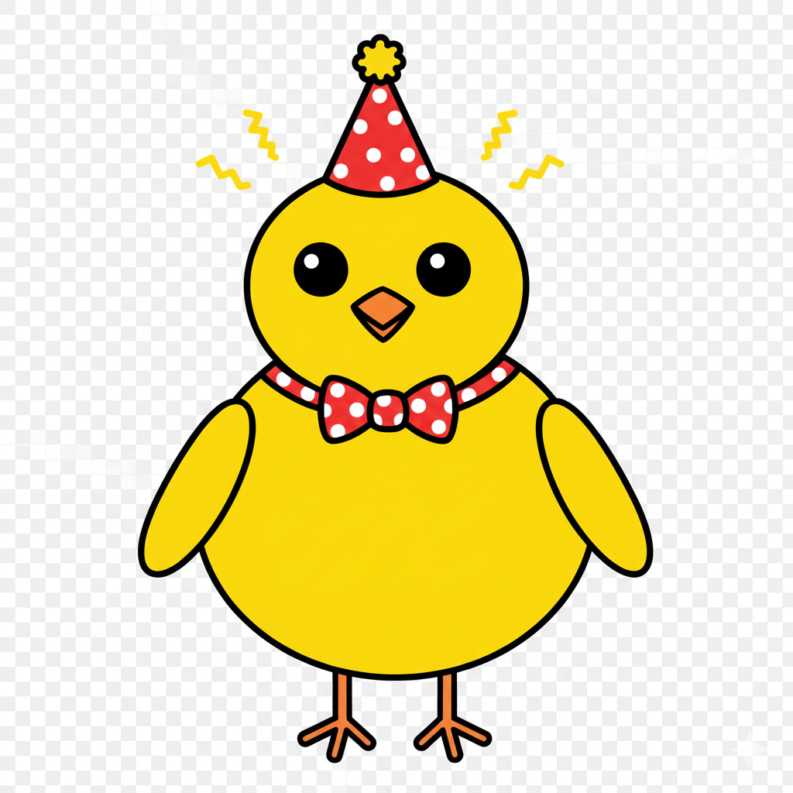

# 🐣 第一週：初探 Scratch 與電子雞的誕生
{: .fs-9 }

歡迎來到 Scratch 程式設計的奇妙世界！這一週我們將認識 Scratch，並且創造出屬於你的第一隻電子雞！
{: .fs-6 .fw-300 }

[開始學習](#學習內容){: .btn .btn-primary .fs-5 .mb-4 .mb-md-0 .mr-2 } [課後反思單](./worksheets/第一週課後反思單.md){: .btn .fs-5 .mb-4 .mb-md-0 }

---

## 🎯 本週學習目標

完成本週課程後，你將能夠：

### 💻 技能目標
- ✅ **認識 Scratch 介面**：了解四大區域的功能和基本操作方式
- ✅ **學會基本繪圖**：使用繪圖工具創作角色和背景
- ✅ **掌握事件概念**：理解「當綠旗被點擊」的程式觸發機制
- ✅ **操作基本積木**：讓角色移動、旋轉和說話

### 🎨 創意目標
- 🌟 **設計電子雞角色**：創造獨特的電子雞外觀和個性
- 🌟 **設計生活環境**：為電子雞創造溫馨的家
- 🌟 **發揮個人創意**：加入自己的創意元素和特色

### 🤝 合作目標
- 👥 **學會分享創作**：勇於展示自己的作品
- 👥 **給予正向回饋**：欣賞同學的創作並給予鼓勵
- 👥 **互助解決問題**：遇到困難時尋求協助

---

## 📚 學習內容

### 📖 第一步：認識 Scratch

#### 🌐 什麼是 Scratch？
Scratch 是由麻省理工學院（MIT）開發的免費程式設計平台，特別為兒童和青少年設計。使用 Scratch，你可以：
- 🧩 **拖拉積木**：像玩積木一樣組合程式
- 🎮 **創作遊戲**：製作互動遊戲和動畫
- 🎨 **發揮創意**：結合藝術與程式設計
- 🌍 **分享作品**：與全世界的創作者交流

#### 💻 進入 Scratch 世界
1. **開啟瀏覽器**，前往 [https://scratch.mit.edu/](https://scratch.mit.edu/)
2. **點擊「創作」**按鈕開始你的第一個專案
3. **觀察介面**，看看有哪些區域

### 🏗️ 認識 Scratch 四大區域

<h4>🧩 1. 積木區（左側）</h4>

這裡有各種程式積木，就像積木盒一樣分類整理：

<ul>
<li>動作積木（藍色）：控制角色移動、旋轉</li>
<li>外觀積木（紫色）：改變角色外觀、說話</li>
<li>音效積木（粉紅色）：播放聲音和音樂</li>
<li>事件積木（黃色）：開始執行程式的觸發器</li>
<li>控制積木（橘色）：重複、等待、條件判斷</li>
</ul>

<h4>📝 2. 腳本區（中間）</h4>

這是你的程式創作區域：

<ul>
<li>📦 將積木拖拉到這裡組合</li>
<li>🔗 積木會像拼圖一樣接合</li>
<li>▶️ 點擊積木就會執行</li>
<li>🗑️ 拖拉積木到積木區可以刪除</li>
</ul>

<h4>🎭 3. 舞台區（右上）</h4>

這是你的作品展示區：

<ul>
<li>🎬 角色會在這裡表演</li>
<li>🏠 背景會在這裡顯示</li>
<li>🖱️ 可以點擊角色互動</li>
<li>📱 有綠旗（開始）和紅色停止鈕</li>
</ul>

<h4>👥 4. 角色區（右下）</h4>

管理你的角色和背景：

<ul>
<li>🐱 預設有一隻橘色小貓</li>
<li>➕ 可以新增更多角色</li>
<li>🎨 可以編輯角色造型</li>
<li>🗂️ 切換不同角色的程式</li>
</ul>

### 🎮 第一次體驗：讓貓咪動起來！

讓我們來做第一個程式，讓小貓動起來：

#### 📝 步驟一：基本移動
1. 從「事件」積木區拖拉 **「當綠旗被點擊」** 到腳本區
2. 從「動作」積木區拖拉 **「移動 10 步」** 接在下面
3. 點擊綠旗，看看小貓會怎樣！

#### 📝 步驟二：加上說話
1. 從「外觀」積木區拖拉 **「說 哈囉！ 持續 2 秒」**
2. 接在移動積木的下面
3. 點擊綠旗，小貓現在會說話了！

#### 📝 步驟三：加上旋轉
1. 從「動作」積木區拖拉 **「轉動 15 度」**
2. 插入到移動和說話之間
3. 點擊綠旗，看看效果如何？

🎉 **恭喜！你已經寫出第一個 Scratch 程式了！**

---

## 🎨 創作時間：設計你的電子雞

### 🐣 第一步：創造新角色

#### 🎯 刪除小貓咪
1. 在角色區的小貓身上**右鍵點擊**
2. 選擇「刪除」

#### 🎨 創造電子雞角色
1. 點擊角色區的 **「選擇角色」** 按鈕
2. 選擇 **「繪製」** 選項
3. 現在你進入了繪圖模式！

### 🖌️ 繪圖工具教學

<h4>🖌️ 畫筆工具</h4>

自由繪畫，可以調整粗細和顏色

<ul>
<li>適合畫輪廓線</li>
<li>可以畫細節裝飾</li>
</ul>

<h4>🎨 填色工具</h4>

填滿封閉的區域

<ul>
<li>點擊區域就會填滿</li>
<li>要先有封閉的輪廓</li>
</ul>

<h4>⭕ 圓形工具</h4>

畫出完美的圓形或橢圓

<ul>
<li>拖拉畫出橢圓</li>
<li>按住 Shift 畫正圓</li>
</ul>

<h4>⬜ 矩形工具</h4>

畫出長方形或正方形

<ul>
<li>拖拉畫出長方形</li>
<li>按住 Shift 畫正方形</li>
</ul>

### 📐 電子雞繪製教學

#### 🎯 基本造型設計
跟著這個步驟創造你的電子雞：

**步驟1：畫身體**
- 使用圓形工具在畫布中央畫一個大橢圓
- 選擇你喜歡的顏色（黃色、粉紅色、藍色都很棒！）

**步驟2：畫頭部**
- 在身體上方畫一個小一點的圓
- 可以和身體同色或不同色

**步驟3：加上眼睛**
- 用黑色畫兩個小圓點
- 或者用白色圓圈加黑色圓點

**步驟4：畫嘴巴**
- 用橘色畫一個小三角形
- 這就是可愛的小嘴巴

**步驟5：添加特色（可選）**
- 翅膀：身體兩側的小橢圓
- 腳：身體下方的兩條線
- 帽子、蝴蝶結等裝飾

#### 🎨 顏色搭配建議

<h5>🌅 溫暖色調</h5>

黃色 + 橘色 + 紅色

感覺：活潑、溫暖、有活力

<h5>🌊 冷色調</h5>

藍色 + 綠色 + 紫色

感覺：冷靜、清爽、優雅

<h5>🎨 中性色調</h5>

米色 + 棕色 + 灰色

感覺：溫和、自然、穩重

<h5>🌈 彩虹色調</h5>

多種鮮豔顏色組合

感覺：繽紛、快樂、有創意

#### 💡 創意發想提示

**讓你的電子雞更特別：**
- 🎩 **加上帽子**：畫一頂可愛的小帽子
- 🎀 **蝴蝶結裝飾**：在頭上或脖子上加蝴蝶結
- ⭐ **特殊花紋**：身上畫星星、愛心或條紋
- 😊 **獨特表情**：設計專屬的可愛表情
- 🌈 **漸層效果**：使用多種相近顏色

#### 🖼️ 參考範例

以下是一些電子雞設計的參考圖片，幫助你發想創意：

**從範例中可以學到：**
- 🎨 **色彩搭配**：觀察顏色如何協調搭配
- 👁️ **五官設計**：不同的眼睛和嘴巴表現方式
- ✨ **裝飾元素**：如何添加個性化的小細節
- 📐 **比例關係**：頭部和身體的大小比例

### 🏠 第二步：設計電子雞的家

#### 🎭 建立背景
1. 在舞台區點擊左下角的 **背景圖示**
2. 點擊 **「選擇背景」**
3. 選擇 **「繪製」**

#### 🏡 背景主題建議

<h5>🏠 室內場景</h5>
<ul>
<li><strong>臥室</strong>：床、窗戶、時鐘、玩具</li>
<li><strong>廚房</strong>：冰箱、餐桌、食物</li>
<li><strong>客廳</strong>：沙發、電視、地毯</li>
</ul>

💡 溫馨、安全的感覺

<h5>🌳 戶外場景</h5>
<ul>
<li><strong>花園</strong>：花朵、樹木、蝴蝶</li>
<li><strong>海邊</strong>：沙灘、海浪、貝殼</li>
<li><strong>森林</strong>：大樹、蘑菇、陽光</li>
</ul>

💡 自然、清新的感覺

<h5>✨ 奇幻場景</h5>
<ul>
<li><strong>太空</strong>：星星、行星、太空船</li>
<li><strong>城堡</strong>：塔樓、彩虹、雲朵</li>
<li><strong>海底</strong>：珊瑚、魚類、寶箱</li>
</ul>

💡 夢幻、有想像力的感覺

#### 🎨 背景繪製步驟

**花園背景範例：**

1. **畫天空**
   - 用淺藍色填滿上半部
   - 可以加上白雲

2. **畫地面**
   - 用綠色畫出草地
   - 可以用不同深淺的綠色

3. **加入主要元素**
   - 畫幾棵樹
   - 加上一些大花朵

4. **添加細節**
   - 小花、蝴蝶
   - 石頭、小路

5. **最後檢查**
   - 確保電子雞在背景中清楚可見
   - 整體色彩協調

---

## 🎯 實作練習

### ✅ 基本任務（必完成）

#### 任務1：完成電子雞角色
- [ ] 設計獨特的電子雞外觀
- [ ] 為電子雞取一個特別的名字
- [ ] 色彩搭配協調美觀
- [ ] 加入至少一個個人特色元素

#### 任務2：創造背景環境
- [ ] 選擇一個主題場景
- [ ] 畫出主要背景元素
- [ ] 確保電子雞在背景中清楚可見
- [ ] 整體風格統一

#### 任務3：基本程式體驗
- [ ] 讓電子雞執行基本動作（移動、說話）
- [ ] 了解綠旗的功能
- [ ] 嘗試修改積木中的數值

### 🌟 進階挑戰（可選）

#### 挑戰1：多造型設計
- 為電子雞設計2-3種不同的造型
- 嘗試使用「下一個造型」積木

#### 挑戰2：豐富的背景
- 在背景中加入更多細節元素
- 嘗試畫出有深度感的場景

#### 挑戰3：創意實驗
- 嘗試其他類型的積木
- 讓電子雞做出更多有趣的動作

---

## 🤝 分享與回饋

### 🎤 準備你的作品分享

完成創作後，準備向同學展示你的作品：

#### 📋 分享內容
1. **角色介紹（30秒）**
   - 電子雞的名字和個性
   - 設計的特色和亮點

2. **創作理念（30秒）**
   - 為什麼選擇這樣的造型？
   - 靈感來源是什麼？

3. **背景故事（30秒）**
   - 電子雞住在哪裡？
   - 這個環境有什麼特色？

### 👂 聆聽他人分享

#### 🌟 給予正向回饋
觀看同學作品時，注意：
- 最特別的創意點是什麼？
- 有什麼值得學習的地方？
- 可以給什麼建設性建議？

#### 💬 回饋範例
- "我很喜歡你的電子雞的顏色搭配！"
- "你的背景設計很有創意，特別是..."
- "也許可以嘗試加上..."

---

## 📝 學習檢核

### ✅ 知識理解檢核

完成本週學習後，檢查是否達到：

**Scratch 基本認識**
- [ ] 能說出四大區域的名稱和功能
- [ ] 知道如何拖拉積木組合程式
- [ ] 理解綠旗的作用

**繪圖技能**
- [ ] 會使用基本繪圖工具
- [ ] 能創建新的角色和背景
- [ ] 掌握基本色彩搭配原則

**創意表達**
- [ ] 設計出有個人特色的角色
- [ ] 能為作品說明創作理念
- [ ] 願意嘗試不同的創意想法

### 🎯 實作能力檢核

**技能操作**
- [ ] 獨立開啟 Scratch 並建立專案
- [ ] 能讓角色執行基本動作
- [ ] 會保存和分享作品

**問題解決**
- [ ] 遇到困難時會尋求協助
- [ ] 能從錯誤中學習
- [ ] 會嘗試不同的解決方法

---

## 🔮 下週預告

### 🎬 第二週：讓電子雞動起來！

下週我們將學習：
- **動畫製作**：讓電子雞眨眼、搖尾巴
- **重複執行**：讓動畫持續播放  
- **事件互動**：點擊電子雞會有反應
- **造型變化**：製作不同表情的造型

### 🏠 本週回家任務（可選）

1. **觀察動物**：注意身邊動物是怎麼動的
2. **收集靈感**：想想電子雞可以做什麼有趣動作
3. **分享作品**：和家人分享今天的創作
4. **探索 Scratch**：在家繼續探索 Scratch 功能

---

## 🆘 需要幫助？

### 📞 常見問題

**Q: 我的繪圖看起來很醜怎麼辦？**  
A: 沒有醜的創作，只有獨特的風格！重要的是表達你的創意，技巧會隨著練習變好。

**Q: 程式不能執行怎麼辦？**  
A: 檢查積木是否正確連接，確認有「當綠旗被點擊」作為開始。

**Q: 可以參考同學的作品嗎？**  
A: 當然可以！學習從模仿開始，但記得加入自己的創意。

### 🔗 有用資源

- **[Scratch 官方網站](https://scratch.mit.edu/)**：更多教學和範例
- **[繪圖教學](./scratch_examples/02_drawing_tutorial.md)**：詳細的繪圖指導
- **[背景設計範例](./scratch_examples/03_background_examples.md)**：背景創作靈感

---

## 🎊 完成慶祝

**🎉 恭喜你完成第一週的學習！**

你已經：
- 🎯 認識了 Scratch 程式設計環境
- 🎨 創造了屬於自己的電子雞角色
- 🏠 設計了溫馨的生活背景
- 💻 寫出了第一個 Scratch 程式
- 🤝 學會了分享和欣賞他人作品

**你已經踏出成為程式設計師的第一步！** 🚀

## 📝 課後反思時間

課程結束前，花5分鐘回想今天的學習收穫：

[📝 填寫課後反思單](./worksheets/第一週課後反思單.md){: .btn .btn-outline .fs-5 .mb-4 }

*簡化版反思單，只需5-8分鐘即可完成*

---

