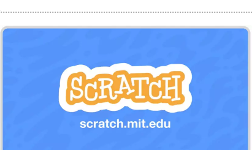
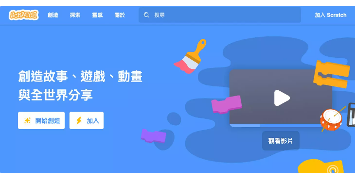
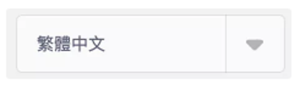
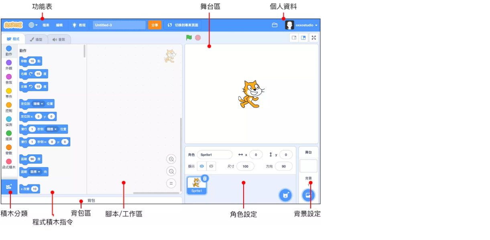

# 🐣 第一週：初探 Scratch 與電子雞的誕生
{: .fs-9 }

歡迎來到 Scratch 程式設計的奇妙世界！這一週我們將認識 Scratch，並且創造出屬於你的第一隻電子雞！
{: .fs-6 .fw-300 }

[開始學習](#學習內容){: .btn .btn-primary .fs-5 .mb-4 .mb-md-0 .mr-2 }

---

## 🎯 本週學習目標

完成本週課程後，你將能夠：

### 💻 技能目標
- ✅ **認識 Scratch 介面**：了解四大區域的功能和基本操作方式
- ✅ **學會換造型顏色**：用填色桶幫角色換上喜歡的顏色
- ✅ **掌握事件概念**：理解「當綠旗被點擊」的程式觸發機制
- ✅ **操作基本積木**：讓角色移動、旋轉和說話

### 🎨 創意目標
- 🌟 **擁有自己的雞**：換顏色、取名字，讓牠成為獨一無二的「你的雞」
- 🌟 **連結真實經驗**：把 Scratch 裡的雞和你在雞舍認養的那隻雞連結起來
- 🌟 **發揮個人創意**：加入自己的創意元素和特色

> 💡 家和背景我們**下週**再做，這週先把雞顧好、讓牠動起來就好！

### 🤝 合作目標
- 👥 **學會分享創作**：勇於展示自己的作品
- 👥 **給予正向回饋**：欣賞同學的創作並給予鼓勵
- 👥 **互助解決問題**：遇到困難時尋求協助

---

## 📚 學習內容

### 📖 第一步：認識 Scratch

#### 🌐 什麼是 Scratch？

Scratch 就像「積木版」的程式設計！不用打一堆看不懂的英文指令，只要把一塊一塊像樂高一樣的「積木」拖過來、疊起來，就能讓角色動起來、說話、玩遊戲。

Scratch 是麻省理工學院（MIT）做的，**完全免費**，全世界已經有 150 多個國家的小朋友在用！

圖片來源：<a href="https://steam.oxxostudio.tw/category/scratch/info/index.html" target="_blank">steam.oxxostudio.tw</a>

#### 🚪 怎麼進去 Scratch？

1. **打開瀏覽器**（Chrome、Safari、Edge 都可以）
2. 在網址列輸入：**scratch.mit.edu**
3. 看到下面這個畫面後，點一下 **「開始創造」**，就會直接進入編輯器！

📌 <strong>不用註冊、不用登入！</strong> 今天我們直接點「開始創造」就可以開始玩了，不需要 Email 帳號。想保存作品的話，老師會教大家怎麼把檔案存到電腦裡。

圖片來源：<a href="https://steam.oxxostudio.tw/category/scratch/info/use-scratch3.html" target="_blank">steam.oxxostudio.tw</a>

#### 🀄 切換成中文

如果打開後看到的是「英文版」也不用怕！在網頁**最下面**，找到語言選單，點一下選單，選擇「**繁體中文**」，畫面就會馬上變成中文！

圖片來源：<a href="https://steam.oxxostudio.tw/category/scratch/info/use-scratch3.html" target="_blank">steam.oxxostudio.tw</a>

### 🏗️ 認識操作介面

進入編輯器後，畫面會分成好幾個區域。看看下面這張圖，記住每個區域在哪裡：

圖片來源：<a href="https://steam.oxxostudio.tw/category/scratch/info/interface.html" target="_blank">steam.oxxostudio.tw</a>

今天我們只要先記住最重要的 4 個地方：

| 區域 | 在哪裡 | 做什麼用 |
|---|---|---|
| 🧩 積木區 | 左邊 | 所有的積木指令都放在這裡 |
| 📝 腳本區 | 中間 | 把積木拖過來，疊出你的程式 |
| 🎭 舞台區 | 右上 | 角色表演的地方，按綠旗就會開始 |
| 👥 角色區 | 右下 | 管理你有哪些角色、背景 |

### 🐔 第二步：換成你自己的雞

超酷的角色設計，我們留到以後慢慢玩。今天用最快的方法，讓每個人 10 分鐘內都有一隻「自己的雞」！

#### 📝 步驟一：選內建雞
1. 到角色區，點擊 **「選擇角色」** 按鈕
2. 在搜尋欄輸入 **hen**
3. 點選那隻雞，牠就會出現在舞台上

#### 🎨 步驟二：換上你喜歡的顏色
1. 點上方的 **「造型」** 頁籤
2. 選擇填色桶工具
3. 點雞身上的某個部位，換成你喜歡的顏色（想換好幾個地方也可以！）

<h5>🌅 溫暖色調</h5>

黃色 + 橘色 + 紅色

<h5>🌊 冷色調</h5>

藍色 + 綠色 + 紫色

<h5>🎨 中性色調</h5>

米色 + 棕色 + 灰色

<h5>🌈 彩虹色調</h5>

多種鮮豔顏色組合

#### 🏷️ 步驟三：取你的雞的名字
1. 在角色區找到雞的名稱欄位
2. 把名字改成**你在雞舍認養的那隻雞的名字**
3. 這樣你的 Scratch 雞和真實世界的雞就是同一隻了！

🎉 **完成！你已經有一隻獨一無二、顏色不一樣、名字不一樣的雞了！**

### 🎬 第三步：讓你的雞動起來

現在幫你的雞寫第一個程式，讓牠會動、會說話：

#### 📝 加上移動
1. 從「事件」積木區拖拉 **「當綠旗被點擊」** 到腳本區
2. 從「動作」積木區拖拉 **「移動 10 步」** 接在下面
3. 點擊綠旗，看看你的雞會怎樣！

#### 📝 加上說話
1. 從「外觀」積木區拖拉 **「說 哈囉！ 持續 2 秒」**
2. 接在移動積木的下面
3. 點擊綠旗，你的雞現在會說話了！

#### 📝 加上轉動
1. 從「動作」積木區拖拉 **「轉動 15 度」**
2. 插入到移動和說話之間
3. 點擊綠旗，看看效果如何？

🎉 **恭喜！你的雞不只有自己的顏色和名字，現在還會動、會說話了！**

🏠 <strong>家和背景，我們下週再做！</strong> 今天先讓雞活起來就好，不用急。

---

## 🎯 實作練習

### ✅ 基本任務（必完成）

#### 任務1：完成你的雞
- [ ] 找到並選擇內建的 hen 角色
- [ ] 換上喜歡的顏色
- [ ] 改成認養雞的名字

#### 任務2：讓雞動起來
- [ ] 讓雞執行基本動作（移動、說話、轉動）
- [ ] 了解綠旗的功能
- [ ] 嘗試修改積木中的數值

### 🌟 進階挑戰（可選，時間夠再做）

#### 挑戰1：多造型設計
- 看看 hen 內建有幾種造型，試試「下一個造型」積木

#### 挑戰2：把貓咪刪掉
- 舞台上如果還有預設的貓咪，試著把牠刪掉，讓舞台只有你的雞

#### 挑戰3：創意實驗
- 嘗試其他類型的積木
- 讓你的雞做出更多有趣的動作

---

## 🎊 完成慶祝

**🎉 恭喜你完成第一週的學習！**

你已經：
- 🎯 認識了 Scratch 程式設計環境
- 🐔 擁有一隻獨一無二、屬於自己的雞
- 💻 寫出了第一個 Scratch 程式，讓雞會動、會說話

**你已經踏出成為程式設計師的第一步！** 🚀

### 🤔 花 3 分鐘想一想

1. 你的雞叫什麼名字？為什麼取這個名字？
2. 今天做的事情裡，哪個步驟最好玩？哪個最卡關？
3. 如果可以再幫你的雞加一個動作，你想加什麼？
4. 跟你認養的那隻真雞說一句話吧！

---

