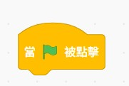
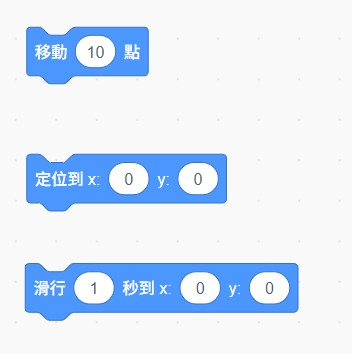
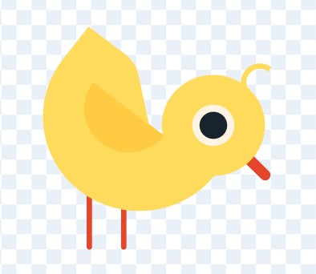
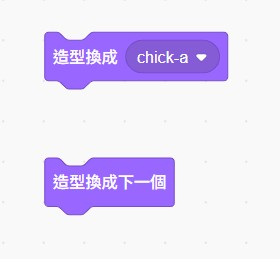
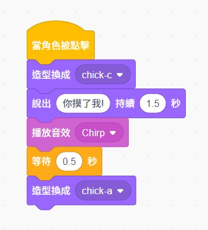

# 🎬 第二週：讓電子雞動起來！
{: .fs-9 }

是時候讓你的電子雞活起來了！這一週我們將學習動畫製作，讓電子雞會眨眼、搖尾巴，並且能夠對你的互動做出可愛的回應。
{: .fs-6 .fw-300 }

[開始學習](#學習內容){: .btn .btn-primary .fs-5 .mb-4 .mb-md-0 .mr-2 } [下載學習單](./worksheets/第二週學習單.md){: .btn .fs-5 .mb-4 .mb-md-0 }

---

## 🎯 本週學習目標

完成本週學習後，你將能夠：

- ✅ **掌握事件觸發**：學會使用「當...時」積木
- ✅ **製作基本動畫**：讓角色移動、旋轉、改變大小
- ✅ **切換造型**：讓電子雞展現不同表情和姿態
- ✅ **處理使用者互動**：回應滑鼠點擊和鍵盤按鍵
- ✅ **運用音效**：為動畫添加生動的聲音效果

## 📚 學習內容

### 1️⃣ 事件積木的魔法
{: .text-green-300}

事件積木是讓電子雞「活起來」的關鍵！它們就像電子雞的「感應器」，能夠察覺到各種變化：

#### 🔸 常用的事件積木

<div class="event-blocks-gallery">

<p class="block-description">程式開始執行</p>


<p class="block-description">滑鼠點擊角色時</p>


<p class="block-description">鍵盤按鍵觸發</p>


<p class="block-description">收到廣播訊息時</p>
</div>

#### 💡 實作練習：電子雞的第一個反應

**步驟1：製作點擊反應**
1. 選擇你的電子雞角色
2. 拖拉「當這個角色被點擊」積木
3. 在下方接上「說 [你好！] 持續 2 秒」
4. 點擊你的電子雞，看看會發生什麼！

### 2️⃣ 動作動畫基礎
{: .text-green-300}

讓電子雞動起來有許多方法，我們先從基本動作開始：

#### 🔸 移動類動畫

<div class="animation-blocks">

</div>

#### 🔸 視覺變化動畫

<div class="animation-blocks">

</div>

#### 💡 實作練習：讓電子雞跳舞

**目標**：製作一個簡單的跳舞動畫

**程式積木組合**：

<div class="example-code">

</div>

### 3️⃣ 造型切換動畫
{: .text-green-300}

造型切換是製作生動動畫的重要技巧！

#### 🔸 準備造型

我們使用 Scratch 內建的小雞角色，它有三種不同的造型：

<div class="costume-gallery">
<div class="costume-item">

<p><strong>1. 平常小雞</strong>：預設的可愛樣子</p>
</div>

<div class="costume-item">

<p><strong>2. 開嘴小雞</strong>：張嘴準備說話或吃東西</p>
</div>

<div class="costume-item">

<p><strong>3. 低頭小雞</strong>：害羞或思考的樣子</p>
</div>
</div>

#### 🔸 造型切換積木

<div class="costume-blocks">

</div>

#### 💡 實作練習：電子雞開闔嘴動畫

**目標**：讓小雞定期開闔嘴巴，就像在說話或呼吸

**步驟**：
1. 選擇 Scratch 內建的小雞角色
2. 使用造型切換製作開闔嘴動畫
3. 建立以下程式：

<div class="practice-code">

</div>

**動畫效果說明**：
- 小雞會從平常樣子開始
- 每隔 2 秒張嘴 0.5 秒
- 形成自然的呼吸或說話效果

### 4️⃣ 互動式動畫設計
{: .text-green-300}

讓小雞能夠回應玩家的各種操作：

#### 🔸 滑鼠互動

**效果**：點擊小雞時，小雞會低頭表示被摸摸

<div class="interaction-example">

</div>

#### 🔸 鍵盤互動

**效果**：按下空白鍵時，小雞會往前移動一步

**需要的積木**：
1. 🔄 **事件積木**：「當按下 [空白] 鍵」
2. 📍 **移動積木**：「移動 (20) 點」
3. 💬 **說話積木**：「說 [你推了我！] 持續 1.5 秒」
4. 🔊 **音效積木**：「播放音效 [bite]」

**積木組合順序**：先移動 → 再說話 → 最後播放音效

#### 💡 實作練習：小雞互動系統

**目標**：設計小雞的完整互動反應系統

**A. 餵食功能 (F鍵)**：

<div class="feed-example">

</div>

**B. 說話功能 (T鍵)**：

**效果**：按下 T 鍵時，小雞會張嘴說話

**需要的積木**：
1. 🔄 **事件積木**：「當按下 [t] 鍵」
2. 🎭 **造型積木**：「換成 [開嘴小雞] 造型」
3. 💬 **說話積木**：「說 [嘰嘰嘰～] 持續 2 秒」
4. 🔊 **音效積木**：「播放音效 [chirp]」
5. ⏱️ **等待積木**：「等待 (0.5) 秒」
6. 🎭 **造型積木**：「換成 [平常小雞] 造型」

**積木組合順序**：先變造型 → 說話 → 播放音效 → 等待 → 恢復造型

#### 🎨 小雞互動造型範例

以下是 Scratch 內建小雞的三種造型及其互動用途：

<div class="demo-gallery">


</div>

**造型用途說明**：
- 🐥 **平常小雞**：日常狀態，等待互動
- 🗣️ **開嘴小雞**：說話、唱歌或呼叫時使用
- 🍚 **低頭小雞**：餵食吃米、害羞或被撫摸時使用

### 5️⃣ 音效與動畫的結合
{: .text-green-300}

聲音能讓動畫更加生動有趣！

#### 🔸 音效積木

```scratch
播放音效 [meow]        # 播放音效（不等待）
播放音效 [meow] 直到播完  # 播放音效（等待結束）
將音量改變 (10)        # 調整音量
停止所有音效           # 停止音效
```

#### 💡 綜合實作：電子雞完整互動

結合所有學過的技巧，製作一個完整的互動動畫：

```scratch
當 🏁 被點擊
重複執行
  等待 (2) 秒
  換成 [眨眼] 造型
  等待 (0.1) 秒
  換成 [預設] 造型

當這個角色被點擊
播放音效 [meow]
換成 [開心] 造型
說 [謝謝你和我玩！] 持續 2 秒
重複 (3) 次
  將大小改變 (10)
  等待 (0.1) 秒
  將大小改變 (-10)
  等待 (0.1) 秒
換成 [預設] 造型
```

## 🎮 本週小挑戰

### 🥉 銅牌挑戰：基礎動畫師
製作一個包含以下功能的電子雞：
- 能夠眨眼（自動重複）
- 點擊時會說話
- 按空白鍵會跳一下

### 🥈 銀牌挑戰：互動設計師
在銅牌基礎上，增加：
- 3種不同的情緒造型
- 對應的鍵盤觸發（h=開心、s=難過、a=生氣）
- 每種情緒都有相應的音效和動作

### 🥇 金牌挑戰：動畫大師
創作一個完整的電子雞互動系統：
- 至少5種不同動畫
- 滑鼠跟隨功能
- 組合動畫（如：開心時會跳舞）
- 背景音樂配合

## 📖 學習資源

### 📋 本週檔案下載
- [🎨 電子雞造型範例](./resources/電子雞造型包.sb3)
- [📝 第二週學習單](./worksheets/第二週學習單.md)
- [🎵 音效素材包](./resources/音效包/)
- [💡 範例程式專案](./scratch_examples/)

### 🎯 重點提醒卡
- **事件積木**是動畫的觸發器
- **等待積木**控制動畫速度
- **造型切換**創造視覺變化
- **音效配合**增加真實感
- **重複積木**製作連續動作

### 🔗 延伸學習
- [Scratch 官方動畫教學](https://scratch.mit.edu/ideas)
- [動畫製作技巧影片](../resources/videos/)
- [下週預告：變數與餵食系統](../week3/)

## 🏆 學習檢核表

在進入下一週前，請確認你已經：

- [ ] 理解事件積木的運作原理
- [ ] 能夠製作基本的移動動畫
- [ ] 學會切換造型製作動畫
- [ ] 能夠處理滑鼠和鍵盤互動
- [ ] 成功結合音效與動畫
- [ ] 完成本週的小挑戰
- [ ] 建立個人的動畫作品

---

## 🎊 完成第二週了嗎？

恭喜你讓電子雞動起來了！現在你的電子雞不再只是靜態的圖片，而是一個會互動、有感情的數位寵物！

下一週我們將學習**變數系統**，為電子雞加入**餵食功能**，讓牠真正需要你的照顧！

[📖 返回課程總覽](../){: .btn .btn-outline } [▶️ 前往第三週](../week3/){: .btn .btn-primary }