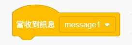
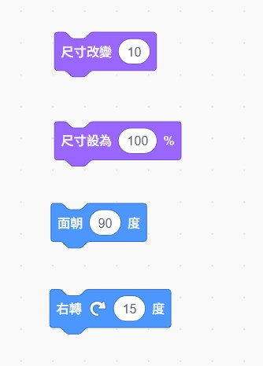
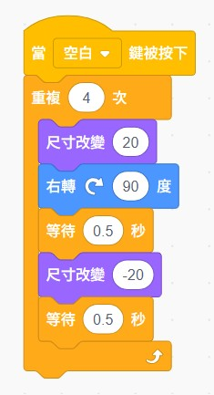
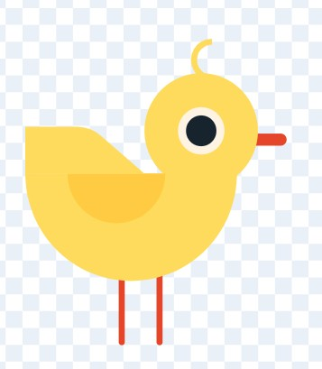
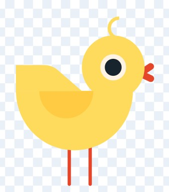
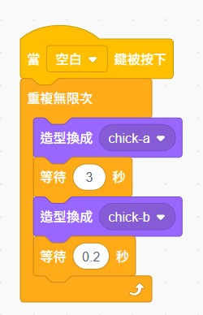
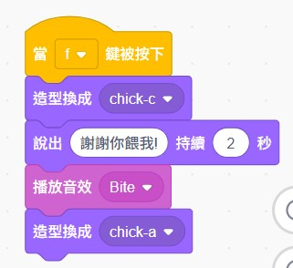
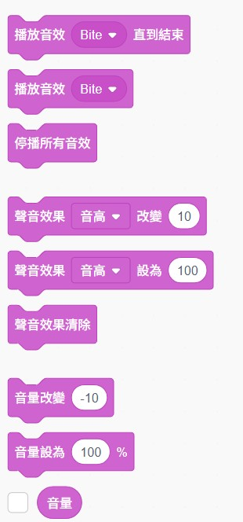

# 🎬 第二週：讓電子雞動起來！
{: .fs-9 }

是時候讓你的電子雞活起來了！這一週我們將學習動畫製作，讓電子雞會眨眼、搖尾巴，並且能夠對你的互動做出可愛的回應。
{: .fs-6 .fw-300 }

[開始學習](#學習內容){: .btn .btn-primary .fs-5 .mb-4 .mb-md-0 .mr-2 } [下載學習單](./worksheets/第二週學習單.md){: .btn .fs-5 .mb-4 .mb-md-0 }

---

## 🎯 本週學習目標

完成本週學習後，你將能夠：

- ✅ **掌握事件觸發**：學會使用「當...時」積木
- ✅ **製作基本動畫**：讓角色移動、旋轉、改變大小
- ✅ **切換造型**：讓電子雞展現不同表情和姿態
- ✅ **處理使用者互動**：回應滑鼠點擊和鍵盤按鍵
- ✅ **運用音效**：為動畫添加生動的聲音效果

## 📚 學習內容

### 1️⃣ 事件積木的魔法
{: .text-green-300}

事件積木是讓電子雞「活起來」的關鍵！它們就像電子雞的「感應器」，能夠察覺到各種變化：

#### 🔸 常用的事件積木

<div class="event-blocks-gallery">

<p class="block-description">程式開始執行</p>


<p class="block-description">滑鼠點擊角色時</p>


<p class="block-description">鍵盤按鍵觸發</p>


<p class="block-description">收到廣播訊息時</p>
</div>

#### 💡 實作練習：電子雞的第一個反應

**步驟1：製作點擊反應**
1. 選擇你的電子雞角色
2. 拖拉「當這個角色被點擊」積木
3. 在下方接上「說 [你好！] 持續 2 秒」
4. 點擊你的電子雞，看看會發生什麼！

### 2️⃣ 動作動畫基礎
{: .text-green-300}

讓電子雞動起來有許多方法，我們先從基本動作開始：

#### 🔸 移動類動畫

<div class="animation-blocks">

</div>

#### 🔸 視覺變化動畫

<div class="animation-blocks">

</div>

#### 💡 實作練習：讓電子雞跳舞

**目標**：製作一個簡單的跳舞動畫

**程式積木組合**：

<div class="example-code">

</div>

### 3️⃣ 造型切換動畫
{: .text-green-300}

造型切換是製作生動動畫的重要技巧！

#### 🔸 準備造型

我們使用 Scratch 內建的小雞角色，它有三種不同的造型：

<div class="costume-gallery">
<div class="costume-item">

<p><strong>1. 平常小雞</strong>：預設的可愛樣子</p>
</div>

<div class="costume-item">

<p><strong>2. 開嘴小雞</strong>：張嘴準備說話或吃東西</p>
</div>

<div class="costume-item">

<p><strong>3. 低頭小雞</strong>：害羞或思考的樣子</p>
</div>
</div>

#### 🔸 造型切換積木

<div class="costume-blocks">

</div>

#### 💡 實作練習：電子雞開闔嘴動畫

**目標**：讓小雞定期開闔嘴巴，就像在說話或呼吸

**步驟**：
1. 選擇 Scratch 內建的小雞角色
2. 使用造型切換製作開闔嘴動畫
3. 建立以下程式：

<div class="practice-code">

</div>

**動畫效果說明**：
- 小雞會從平常樣子開始
- 每隔 2 秒張嘴 0.5 秒
- 形成自然的呼吸或說話效果

### 4️⃣ 互動式動畫設計
{: .text-green-300}

讓小雞能夠回應玩家的各種操作：

#### 🔸 滑鼠互動

**效果**：點擊小雞時，小雞會低頭表示被摸摸

<div class="interaction-example">

</div>

#### 🔸 鍵盤互動

**效果**：按下空白鍵時，小雞會往前移動一步

**需要的積木**：
1. 🔄 **事件積木**：「當按下 [空白] 鍵」
2. 📍 **移動積木**：「移動 (20) 點」
3. 💬 **說話積木**：「說 [你推了我！] 持續 1.5 秒」
4. 🔊 **音效積木**：「播放音效 [bite]」

**積木組合順序**：先移動 → 再說話 → 最後播放音效

#### 💡 實作練習：小雞互動系統

**目標**：設計小雞的完整互動反應系統

**A. 餵食功能 (F鍵)**：

<div class="feed-example">

</div>

**B. 說話功能 (T鍵)**：

**效果**：按下 T 鍵時，小雞會張嘴說話

**需要的積木**：
1. 🔄 **事件積木**：「當按下 [t] 鍵」
2. 🎭 **造型積木**：「換成 [開嘴小雞] 造型」
3. 💬 **說話積木**：「說 [嘰嘰嘰～] 持續 2 秒」
4. 🔊 **音效積木**：「播放音效 [chirp]」
5. ⏱️ **等待積木**：「等待 (0.5) 秒」
6. 🎭 **造型積木**：「換成 [平常小雞] 造型」

**積木組合順序**：先變造型 → 說話 → 播放音效 → 等待 → 恢復造型

#### 🎨 小雞互動造型範例

以下是 Scratch 內建小雞的三種造型及其互動用途：

<div class="demo-gallery">


</div>

**造型用途說明**：
- 🐥 **平常小雞**：日常狀態，等待互動
- 🗣️ **開嘴小雞**：說話、唱歌或呼叫時使用
- 🍚 **低頭小雞**：餵食吃米、害羞或被撫摸時使用

### 5️⃣ 音效與動畫的結合
{: .text-green-300}

聲音能讓動畫更加生動有趣！

#### 🔸 音效積木

<div class="sound-blocks">

</div>

#### 💡 綜合實作：小雞完整互動系統

結合所有學過的技巧，製作一個完整的小雞互動動畫。首先我們需要為小雞新增眨眼造型：

### 🎨 第一步：下載並新增眨眼造型

1. **下載眨眼造型檔案**：
   - [📁 下載眨眼.svg](./resources/眨眼.svg) （右鍵另存新檔）

2. **在 Scratch 中新增造型**：
   - 點擊小雞角色的「造型」分頁
   - 點擊左下角的「上傳造型」按鈕 📁
   - 選擇剛才下載的 `眨眼.svg` 檔案
   - 造型會自動匯入，命名為「眨眼」

3. **調整造型位置**：
   - 確保眨眼造型與平常小雞的位置對齊
   - 可以使用選取工具調整位置

### 🎮 第二步：完整互動程式

現在我們可以製作包含眨眼功能的完整互動系統：

**使用這個事件積木開始程式**：
 當綠旗被點擊

```scratch
當 綠旗 被點擊
重複執行
  等待 (取 2 到 4 的隨機數) 秒
  換成 [眨眼] 造型
  等待 (0.2) 秒
  換成 [平常小雞] 造型

當這個角色被點擊
播放音效 [chirp]
換成 [低頭小雞] 造型
說 [謝謝你和我玩！] 持續 2 秒
重複 (3) 次
  將大小改變 (10)
  等待 (0.1) 秒
  將大小改變 (-10)
  等待 (0.1) 秒
換成 [平常小雞] 造型
```

## 🎮 本週小挑戰

<table class="challenge-table">
<thead>
<tr>
<th>🥉 銅牌挑戰<br>基礎動畫師</th>
<th>🥈 銀牌挑戰<br>互動設計師</th>
<th>🥇 金牌挑戰<br>動畫大師</th>
</tr>
</thead>
<tbody>
<tr>
<td>
<strong>目標</strong>：製作基本互動小雞<br><br>
<strong>必備功能</strong>：<br>
• 自動開闔嘴動畫<br>
• 點擊會低頭說話<br>
• 按空白鍵會移動<br><br>
<strong>完成時間</strong>：15分鐘
</td>
<td>
<strong>目標</strong>：在銅牌基礎上增強互動<br><br>
<strong>新增功能</strong>：<br>
• 3種小雞造型運用<br>
• F鍵餵食功能<br>
• T鍵說話功能<br>
• 音效配合動作<br><br>
<strong>完成時間</strong>：25分鐘
</td>
<td>
<strong>目標</strong>：創作完整互動系統<br><br>
<strong>進階功能</strong>：<br>
• 至少5種不同互動<br>
• 組合動畫效果<br>
• 創意音效搭配<br>
• 個人化設計元素<br><br>
<strong>完成時間</strong>：35分鐘
</td>
</tr>
</tbody>
</table>

## 📝 五分鐘課堂反思

**姓名**：＿＿＿＿＿＿　**班級**：＿＿＿＿　**日期**：＿＿＿＿

### 1️⃣ 我學會了什麼？（請勾選）
- [ ] 使用事件積木讓小雞回應點擊
- [ ] 製作小雞開闔嘴動畫
- [ ] 讓小雞回應鍵盤按鍵
- [ ] 加入音效讓互動更有趣

### 2️⃣ 今天最有成就感的是：
□ 成功做出開闔嘴動畫　□ 小雞會回應我的點擊　□ 加入了音效　□ 其他：＿＿＿＿

### 3️⃣ 我遇到的困難是：
□ 找不到對的積木　□ 不知道積木順序　□ 造型切換有問題　□ 沒有困難

### 4️⃣ 下次我想讓小雞：
＿＿＿＿＿＿＿＿＿＿＿＿＿＿＿＿＿＿＿＿＿＿＿＿＿＿＿＿

### 5️⃣ 給自己今天的表現打分數：⭐⭐⭐⭐⭐ （圈選1-5顆星）

---

## 🎊 完成第二週了嗎？

恭喜你讓小雞動起來了！現在你的小雞不再只是靜態的圖片，而是一個會互動、有感情的數位寵物！

---

## 🔮 第三週課程預告：民以食為天！

### 🍖 即將學習的重點內容

你的小雞現在會動會回應，但是牠還缺少一個重要的生命特徵——**會餓！**

**第三週**我們將進入更進階的程式概念：

#### 📊 **變數系統**：電子雞的生命數據
- 🔢 學習什麼是變數，如何建立和使用
- 📉 建立飢餓度系統，讓數值隨時間自然下降
- 📈 設計餵食機制，讓飢餓度回復

#### 🍎 **餵食互動**：真實的照顧體驗
- 🎯 設計可點擊的食物角色（蘋果、蟲蟲等）
- 💬 使用廣播訊息讓食物和小雞互動
- 🎵 加入餵食音效和動畫回饋

#### 😊 **狀態表情**：讓數字變成圖像
- 🎭 根據飢餓度自動切換小雞表情
- 😋 飽足時開心，飢餓時難過
- 🚫 吃太飽時會拒絕食物

### 🎮 你將能夠創造：
- ✨ 一個真正需要照顧的電子寵物
- 🎲 多種不同效果的食物系統
- 📊 視覺化的生命數值顯示
- 🎪 完整的餵食遊戲體驗

### 💡 小提示
完成第三週後，你的小雞將從「會動的角色」進化為「需要照顧的寵物」！這是程式設計中非常重要的一步——學會管理和操作數據。

準備好成為電子雞的專業飼主了嗎？ 🐣✨

[📖 返回課程總覽](../){: .btn .btn-outline } [🍖 前往第三週：餵食系統](../week3/){: .btn .btn-primary }