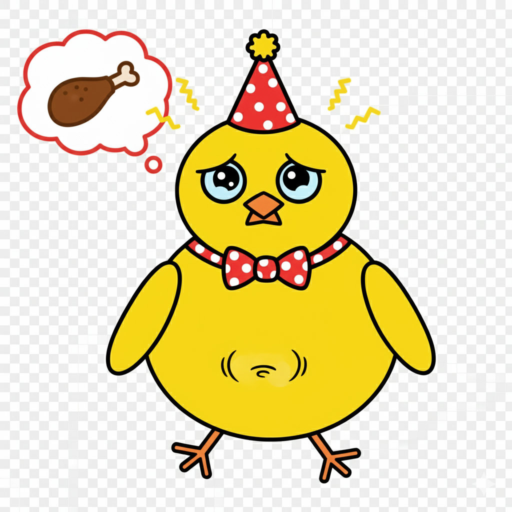

# 🍖 第三週：民以食為天：餵食系統
{: .fs-9 }

電子雞會餓！這一週我們將學習變數的概念，為電子雞建立飢餓度系統，讓牠真正需要你的照顧和餵食。學會管理數據，你就能創造更真實的養成遊戲！
{: .fs-6 .fw-300 }

[開始學習](#學習內容){: .btn .btn-primary .fs-5 .mb-4 .mb-md-0 .mr-2 } [下載學習單](./worksheets/第三週學習單.md){: .btn .fs-5 .mb-4 .mb-md-0 }

---

## 🎯 本週學習目標

完成本週學習後，你將能夠：

### 💻 技能目標
- ✅ **理解變數概念**：知道什麼是變數以及如何使用
- ✅ **建立數值系統**：創建飢餓度、快樂度等狀態數值
- ✅ **程式化餵食**：設計點擊餵食的互動機制
- ✅ **廣播訊息**：學會讓不同角色之間溝通
- ✅ **條件判斷基礎**：根據飢餓度顯示不同反應

### 🎨 創意目標
- 🌟 **設計食物道具**：創造各種可愛的食物角色
- 🌟 **規劃餵食流程**：設計直觀的餵食互動體驗
- 🌟 **視覺化數值**：讓抽象的數字變成具體的圖像

### 🤝 邏輯目標
- 👥 **數據思維**：理解數字在程式中的重要性
- 👥 **系統設計**：規劃遊戲機制的邏輯流程
- 👥 **問題分析**：學會將複雜問題分解成簡單步驟

---

## 📚 學習內容

### 1️⃣ 認識變數：電子雞的生命數據
{: .text-green-300}

變數就像是電子雞的「生命指標」，記錄著牠的各種狀態！

#### 🔸 什麼是變數？

想像變數就像一個**標籤盒子**：
- 📦 **盒子名稱**：變數的名字（如：飢餓度）
- 📋 **盒子內容**：儲存的數值（如：50）
- 🔄 **可以更換**：數值會隨時間和互動改變

#### 🔸 建立你的第一個變數

**步驟詳解**：
1. 點擊積木區的「變數」分類
2. 點擊「建立一個變數」按鈕
3. 輸入變數名稱：`飢餓度`
4. 選擇「適用於所有角色」
5. 看看舞台上出現了變數顯示框！

#### 💡 實作練習：電子雞的生命數據

**目標**：建立電子雞的基本狀態系統

**步驟詳解**：
1. 點擊積木區的「變數」分類
2. 點擊「建立一個變數」按鈕
3. 輸入變數名稱：`飢餓度`
4. 設定初始值為 80：使用「將 [飢餓度] 設為 (80)」

### 2️⃣ 時間流逝：飢餓度的自然下降
{: .text-green-300}

真實的電子雞會隨著時間變餓，我們來模擬這個現象！

#### 💡 實作練習：建立時間系統

**使用這個事件積木開始程式**：
 當綠旗被點擊

**程式邏輯**：
```scratch
當 綠旗 被點擊
重複執行
  等待 (3) 秒
  將 [飢餓度] 改變 (-1)
  如果 <(飢餓度) < (20)> 那麼
    換成 [飢餓] 造型
    說 [我好餓...] 持續 1 秒
  結束
```

#### 🎨 飢餓狀態視覺範例

<div style="text-align: center; margin: 2rem 0;">

<p><strong>飢餓狀態範例</strong><br>電子雞開始想著美味的食物！</p>
</div>

### 3️⃣ 創造食物：可愛的營養補給
{: .text-green-300}

電子雞需要各種食物來維持生命！讓我們創造一些美味的食物角色。

#### 💡 實作練習：設計食物角色

**製作步驟**：
1. 點擊「選擇一個角色」按鈕
2. 選擇 Apple 蘋果角色（或繪製自己的食物）
3. 為食物角色加入以下程式：

```scratch
當這個角色被點擊
廣播訊息 [餵食蘋果]
等待 (0.5) 秒
隱藏
等待 (3) 秒
顯示
```

### 4️⃣ 餵食機制：點擊互動系統
{: .text-green-300}

現在來建立餵食的互動機制，讓玩家能夠照顧電子雞！

#### 💡 實作練習：完整餵食系統

**電子雞角色程式**：
```scratch
當接收到 [餵食蘋果]
如果 <(飢餓度) < (90)> 那麼
  將 [飢餓度] 改變 (20)
  換成 [開心] 造型
  說 [謝謝！好好吃！] 持續 2 秒
  播放音效 [chomp]
否則
  說 [我已經飽了！] 持續 2 秒
  換成 [拒絕] 造型
結束
```

### 5️⃣ 視覺化數值：讓數字變圖像
{: .text-green-300}

單純的數字太抽象了！讓我們用視覺化的方式顯示電子雞的狀態。

#### 💡 實作練習：狀態表情系統

**程式邏輯**：
```scratch
重複執行
如果 <(飢餓度) > (70)> 那麼
  換成 [開心] 造型
否則
  如果 <(飢餓度) > (30)> 那麼
    換成 [普通] 造型
  否則
    換成 [飢餓] 造型
  結束
結束
等待 (1) 秒
```

---

## 🎮 本週實戰項目

### 🥉 銅牌任務：基礎餵食系統
**必完成項目**：
- [ ] 建立飢餓度變數
- [ ] 飢餓度隨時間自動下降
- [ ] 製作至少2種食物
- [ ] 點擊食物能餵食電子雞
- [ ] 電子雞會根據飢餓度改變表情

### 🥈 銀牌任務：多元數值系統
**在銅牌基礎上增加**：
- [ ] 建立快樂度和健康度變數
- [ ] 不同食物有不同效果
- [ ] 電子雞會拒絕在飽腹時進食
- [ ] 加入音效和動畫回饋
- [ ] 數值達到危險值時有特殊警告

### 🥇 金牌任務：完整養成系統
**創造專業級的餵食系統**：
- [ ] 設計5種以上不同食物
- [ ] 建立食物稀有度系統
- [ ] 過度餵食會有負面效果
- [ ] 視覺化的數值顯示（如血條）
- [ ] 食物有冷卻時間限制
- [ ] 加入特殊食物和隨機事件

---

## 📚 學習資源包

### 📁 本週下載檔案
- [🎨 食物角色素材包](./resources/食物素材包.sb3)
- [📝 第三週學習單](./worksheets/第三週學習單.md)
- [🎵 餵食音效包](./resources/餵食音效包/)
- [💡 完整範例專案](./scratch_examples/電子雞餵食系統.sb3)
- [📊 數值平衡表](./resources/數值設計指南.pdf)

### 🔗 參考教材對照
根據我們的[輔助教材比較分析](../resources/輔助教材比較分析.md)：

- **主要參考**：撿球機器人範例（變數應用概念）
- **調整重點**：將撿球邏輯改為餵食邏輯
- **額外學習**：自定義變數管理系統

---

## 🏆 學習檢核清單

### ✅ 概念理解檢核
完成本週學習後，確認你已經：

**變數概念**
- [ ] 理解變數是什麼以及如何使用
- [ ] 能夠建立和命名變數
- [ ] 會使用「設為」和「改變」積木
- [ ] 了解變數在不同角色間的作用

**餵食系統**
- [ ] 設計合理的飢餓度下降機制
- [ ] 建立多種食物與效果系統
- [ ] 實現點擊餵食的互動流程
- [ ] 加入適當的音效和視覺回饋

**邏輯思維**
- [ ] 能夠設計合理的數值平衡
- [ ] 理解條件判斷的邏輯結構
- [ ] 學會將複雜系統分解為簡單步驟

### 🎯 實作能力檢核

**技術操作**
- [ ] 獨立建立和管理變數系統
- [ ] 熟練使用廣播訊息機制
- [ ] 能夠設計互動式的遊戲元素
- [ ] 會進行基本的程式除錯

**創意設計**
- [ ] 設計有趣且平衡的餵食系統
- [ ] 創造多樣化的食物和效果
- [ ] 加入個人創意和特色元素

---

## 🔮 下週預告

### 🎮 第四週：吃飽也要開心玩：互動遊戲（一）

下週我們將進入更有趣的階段：
- **條件判斷進階**：複雜的if-else邏輯
- **滑鼠偵測系統**：讓電子雞跟隨滑鼠移動
- **小遊戲設計**：為電子雞設計娛樂活動
- **快樂度機制**：建立完整的情緒系統

### 🏠 本週練習建議

1. **複習變數操作**：多練習不同的數值計算
2. **實驗食物效果**：嘗試設計更多創意食物
3. **觀察數值平衡**：調整各種數值直到遊戲感覺有趣
4. **分享創作**：和家人朋友分享你的餵食系統

---

## 🎊 完成第三週慶祝

**🎉 恭喜你建立了電子雞的餵食系統！**

你已經掌握了：
- 🔢 **變數系統**：程式設計中最重要的概念之一
- 🍖 **互動設計**：讓使用者能夠與程式互動
- 📊 **數據管理**：學會處理和顯示數據
- 🎮 **遊戲邏輯**：設計有趣且平衡的遊戲機制

**你的電子雞現在真的需要你的照顧了！** 🥰

下週我們將讓牠更加活潑，增加更多好玩的互動遊戲！

[📖 返回課程總覽](../){: .btn .btn-outline } [▶️ 前往第四週](../week4/){: .btn .btn-primary }