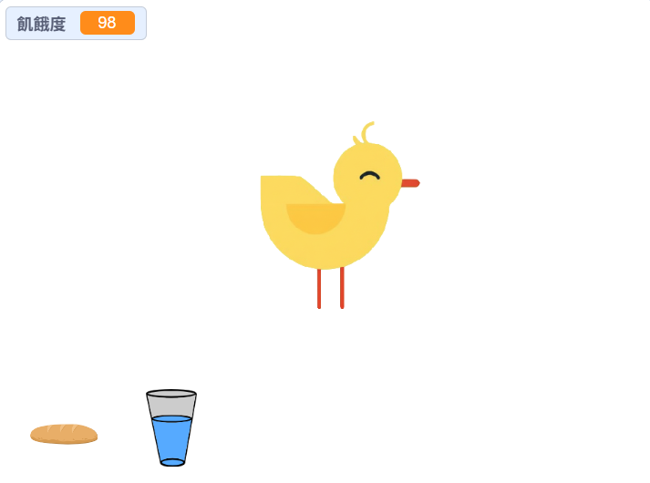
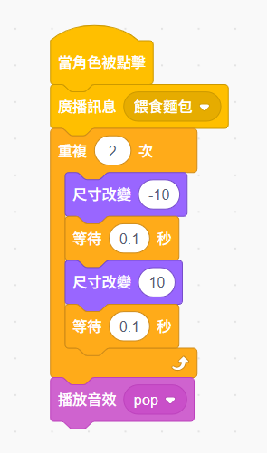
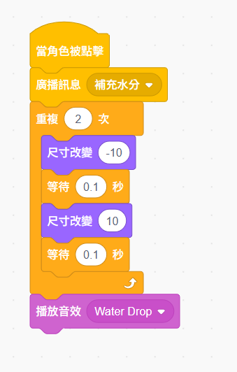
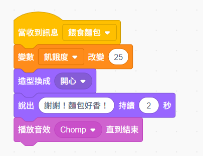
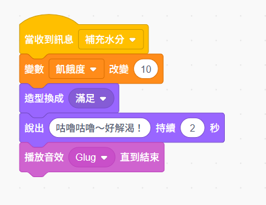

# 🍖 第三週：民以食為天：餵食系統

{: .fs-9 }

電子雞會餓！這一週我們將學習變數的概念，為電子雞建立飢餓度系統，讓牠真正需要你的照顧和餵食。學會管理數據，你就能創造更真實的養成遊戲！
{: .fs-6 .fw-300 }

[開始學習](#學習內容){: .btn .btn-primary .fs-5 .mb-4 .mb-md-0 .mr-2 } [課後反思單](./worksheets/第三週課後反思單.md){: .btn .fs-5 .mb-4 .mb-md-0 }

---

## 🎯 本週學習目標

完成本週學習後，你將能夠：

### 💻 技能目標

- ✅ **理解變數概念**：知道什麼是變數以及如何使用
- ✅ **建立數值系統**：創建飢餓度等狀態數值
- ✅ **多角色管理**：學會新增和排列多個角色
- ✅ **廣播訊息系統**：掌握角色間的通訊機制
- ✅ **工具列設計**：建立 iPad 友善的觸控介面
- ✅ **基礎反應設計**：讓電子雞能夠對餵食做出回應

### 🎨 創意目標

- 🌟 **設計食物工具列**：創造簡潔美觀的操作介面
- 🌟 **規劃餵食流程**：設計直觀的點擊互動體驗
- 🌟 **視覺化數值**：讓抽象的數字變成具體的圖像

### 🤝 邏輯目標

- 👥 **數據思維**：理解數字在程式中的重要性
- 👥 **系統設計**：學會多角色協作的程式架構
- 👥 **訊息傳遞**：掌握角色間溝通的基本原理
- 👥 **介面設計**：建立使用者友善的操作方式

---

## 🎬 本週課程預覽

{: .text-green-300}

### 你的電子雞會餓了！

想像一下：你的電子雞在螢幕上咕嚕咕嚕叫，肚子餓得不得了... 🐤💭🍞

上週我們學會讓電子雞說話、移動，但牠還不是一個「真正活著」的生命。這週開始，一切都不一樣了！

**這一週，你將學會三個讓電子雞「活起來」的魔法技能：**

- 🔢 **變數魔法**：用數字記錄電子雞的生命狀態
- 🎭 **角色協作**：讓多個角色一起工作
- 📢 **廣播通訊**：讓角色之間能夠互相傳話

完成後，你的電子雞將需要你真正的照顧！牠會餓、會渴，需要你餵食才能生存。這就是養成遊戲最有趣的地方！

---

### 📦 上週請假或找不到進度？

{: .highlight }
如果你上週沒來上課，或找不到上次的檔案，沒關係！
點擊下方按鈕下載「第三週開始程式」，就可以從這週繼續學習！

[⬇️ 下載第三週開始程式](./resources/第三週開始程式.sb3){: .btn .btn-primary .fs-5 .mb-4 }

**這個檔案包含**：
- ✅ 已完成第一、二週的電子雞基本設定
- ✅ 電子雞有基本的造型和動作
- ✅ 可以直接開始學習本週內容

---

## 📚 學習內容

### 1️⃣ 認識變數：電子雞的生命數據

{: .text-green-300}

變數就像是電子雞的「生命指標」，記錄著牠的各種狀態！

#### 🔸 什麼是變數？

想像變數就像一個**標籤盒子**：

- 📦 **盒子名稱**：變數的名字（如：飢餓度）
- 📋 **盒子內容**：儲存的數值（如：50）
- 🔄 **可以更換**：數值會隨時間和互動改變

#### 🔸 建立你的第一個變數

**步驟詳解**：

1. 點擊積木區的「變數」分類
2. 點擊「建立一個變數」按鈕
3. 輸入變數名稱：`飢餓度`
4. 選擇「適用於所有角色」
5. 看看舞台上出現了變數顯示框！

<div style="text-align: center; margin: 2rem 0;">

<p><strong>變數顯示框範例</strong><br>舞台上會出現這樣的數字顯示框！</p>
</div>

#### 💡 實作練習：電子雞的生命數據

**目標**：建立電子雞的基本狀態系統

**步驟詳解**：

1. 點擊積木區的「變數」分類
2. 點擊「建立一個變數」按鈕
3. 輸入變數名稱：`飢餓度`
4. 設定初始值為 80：使用「將 [飢餓度] 設為 (80)」

### 2️⃣ 時間流逝：飢餓度的自然下降

{: .text-green-300}

真實的電子雞會隨著時間變餓，我們來模擬這個現象！

#### 💡 實作練習：建立時間系統

**使用這個事件積木開始程式**：
 當綠旗被點擊

**程式邏輯**：

```scratch
當 綠旗 被點擊
重複執行
  等待 (3) 秒
  將 [飢餓度] 改變 (-1)
  等待 (1) 秒
```

**💡 溫馨提示**：這週我們先學會讓飢餓度下降，下週再教電子雞如何聰明地回應不同狀況！

### 3️⃣ 多角色管理基礎：建立食物工具列

{: .text-green-300}

在為電子雞設計餵食系統前，我們需要學會管理多個角色，建立一個簡單的食物工具列。

#### 🔸 我們的角色配置

- **🐥 電子雞角色**：主角，接收餵食指令
- **🍞 麵包角色**：主食工具，提供大量飽食感
- **💧 水瓶角色**：飲水工具，解決口渴問題

#### 💡 實作練習：建立食物工具列

**步驟 1：新增麵包角色**

1. 點擊「選擇一個角色」按鈕
2. 在 Scratch 角色庫搜尋「Bread」（麵包）
3. 調整大小到適中，拖曳到舞台下方左側

{: .note }
💡 **小提示**：Scratch 角色庫裡就有麵包圖案！你也可以選擇下載我們提供的可愛麵包圖 [bread_syokupan.png](./resources/bread_syokupan.png)，然後用「上傳角色」功能匯入。

**步驟 2：新增水瓶角色**

1. 再次點擊「選擇一個角色」按鈕
2. 在 Scratch 角色庫搜尋「Glass of Water」（水杯）
3. 調整大小，放在麵包旁邊

{: .note }
💡 **小提示**：Scratch 角色庫也有水杯圖案！你也可以下載我們的水瓶圖 [bottle_water.png](./resources/bottle_water.png) 來使用。

**工具列佈局效果**：

<div style="text-align: center; margin: 2rem 0;">

<p><strong>舞台設計範例</strong><br>電子雞在中央，食物工具排列在下方！</p>
</div>

#### 💭 想一想：為什麼要用工具列？

{: .important }
**暫停思考時間！**
在繼續之前，請想想看：我們為什麼不直接用鍵盤（例如按 A 鍵餵麵包、按 B 鍵給水），而是要在舞台下方放食物工具列呢？

**給自己 30 秒思考時間... ⏰**

<details markdown="1">
<summary><strong>💡 點擊這裡看答案</strong></summary>

<div style="background: #f0f7ff; padding: 1rem; border-radius: 8px; margin-top: 1rem;" markdown="1">

**工具列設計的四大優點：**

1. **📱 iPad 友善**：用 iPad 上課的同學可以直接點螢幕，不需要鍵盤！
2. **👁️ 視覺清楚**：一看就知道有哪些食物可以餵，不用記按鍵
3. **🎮 直覺操作**：點圖片就能餵食，就像真的在玩遊戲
4. **✨ 容易擴展**：以後想加新食物，只要加新圖片就好了

這就是遊戲設計師的思維：讓所有人都能輕鬆玩你的遊戲！

</div>

</details>

### 4️⃣ 廣播訊息系統：讓角色互相溝通

{: .text-green-300}

現在要讓食物工具能夠「告訴」電子雞該做什麼。這就需要用到**廣播訊息**系統！

#### 🔸 什麼是廣播訊息？

「廣播」這個詞可能有點抽象，讓我們用生活中的例子來理解！

**📻 生活例子 1：學校的廣播系統**

想像一下學校的廣播：

- 校長在廣播室說：「請四年級同學到操場集合！」
- 四年級的同學聽到了，就出發去操場
- 其他年級的同學聽到了，但不用動，因為不是叫他們

在 Scratch 裡也一樣：

- 麵包角色「廣播」：「餵食麵包」
- 電子雞角色聽到「餵食麵包」，就開始吃
- 水瓶角色也聽到了，但牠的程式裡沒有寫「當接收到餵食麵包」，所以不會動

**🍚 生活例子 2：家裡開飯**

- 媽媽在廚房大喊：「開飯了！」（廣播訊息）
- 全家人聽到了，都來餐桌吃飯（接收訊息並執行動作）
- 如果媽媽喊的是「哥哥來幫忙」，那只有哥哥會去廚房

**🚪 生活例子 3：快遞按門鈴**

- 快遞員按門鈴（發送訊息）
- 家裡的人聽到門鈴聲（接收訊息）
- 有人去開門（執行動作）

---

**在 Scratch 的廣播系統中：**

- 📢 **廣播訊息**：一個角色發出通知（像按門鈴）
- 📻 **當接收到訊息**：另一個角色聽到通知（聽到門鈴）
- 🎬 **執行動作**：接收到的角色做出反應（去開門）
- 💬 **訊息名稱**：就像說中文還是英文，要對上才聽得懂

#### 💡 實作練習：設計麵包角色程式

**📍 以下程式放在「麵包角色」中**：

<div style="text-align: center; margin: 2rem 0;">

</div>

**程式說明**：

- **當這個角色被點擊**：玩家點麵包時觸發
- **廣播訊息 [餵食麵包]**：告訴電子雞「有麵包來了」
- **重複動畫**：麵包會縮小再放大，產生「被按壓」的視覺回饋
- **播放音效**：讓玩家知道點擊成功（音效可選，沒有也沒關係）

#### 💡 實作練習：設計水瓶角色程式

**📍 以下程式放在「水瓶角色」中**：

<div style="text-align: center; margin: 2rem 0;">

</div>

**程式說明**：

- **當這個角色被點擊**：玩家點水瓶時觸發
- **廣播訊息 [補充水分]**：告訴電子雞「水來了」
- **重複動畫**：水瓶會左右搖晃，模擬倒水的動作
- **播放音效**：可以加入水聲（選用功能）

### 5️⃣ 電子雞的智慧回應系統

{: .text-green-300}

現在要讓電子雞能夠「聽懂」食物工具的訊息，並做出相應的反應！

#### 💡 實作練習：電子雞接收麵包餵食

**📍 以下程式放在「電子雞角色」中**：

<div style="text-align: center; margin: 2rem 0;">

</div>

**程式說明**：

- **當接收到 [餵食麵包]**：聽到麵包發出的廣播訊息
- **將 [飢餓度] 改變 (25)**：吃麵包可以恢復 25 點飢餓度
- **造型換成 [開心]**：切換到開心的表情
- **說出感謝的話**：讓電子雞說「謝謝！麵包好香！」
- **播放音效**：可以加入吃東西的聲音（選用功能）

#### 💡 實作練習：電子雞接收水分補充

**📍 以下程式放在「電子雞角色」中**：

<div style="text-align: center; margin: 2rem 0;">

</div>

**程式說明**：

- **當接收到 [補充水分]**：聽到水瓶發出的廣播訊息
- **將 [飢餓度] 改變 (10)**：喝水可以恢復 10 點飢餓度
- **造型換成 [滿足]**：切換到滿足的表情
- **說出解渴的話**：讓電子雞說「咕嚕咕嚕～好解渴！」
- **播放音效**：可以加入喝水的聲音（選用功能）

#### 🔸 廣播訊息的優點

- **角色分工明確**：每個角色負責自己的事
- **程式好管理**：不同功能分散在不同角色
- **容易擴展**：要加新食物只需加新角色和新訊息
- **iPad 友善**：純點擊操作，不需要鍵盤

### 6️⃣ 觀察數值變化：學會看懂變數

{: .text-green-300}

現在我們已經建立了完整的餵食系統！但是，為什麼要學會「看數字」呢？

#### 🎮 為什麼要學會看數字？

想像一下，如果你在玩一個遊戲：

- 🩸 **沒有血量顯示**：你不知道角色快死了，突然就 Game Over
- ⚡ **沒有魔力值**：你不知道能不能放大絕招，結果關鍵時刻放不出來
- 🎯 **沒有分數顯示**：你不知道做得好不好，玩起來很沒成就感

**電子雞的飢餓度就是牠的「生命值」！**

- 如果不會看數字，你就不知道電子雞什麼時候該餵食
- 可能會讓牠太餓（數值太低）或餵太飽（數值太高）
- 無法設計出好玩又平衡的遊戲

**這就是遊戲設計的核心技能：數值平衡！** 🎯

所有好玩的遊戲，背後都有精心設計的數字系統。現在，讓我們來觀察你的電子雞的數值變化！

---

#### 💡 觀察練習：成為遊戲平衡大師

**這個練習的目的**：

所有成功的遊戲都需要**數值平衡**！如果飢餓度掉太快，玩家會覺得很煩；如果掉太慢，遊戲就不好玩。讓我們用科學方法來測試你的電子雞設計是否平衡！

---

**🎮 觀察任務 1：計算生存時間**

{: .important }
**任務目標**：找出「電子雞可以活多久」

1. 點綠旗開始，飢餓度從 80 開始
2. 每 3 秒減少 1 點
3. **計算看看**：
   - 3 分鐘(180秒)會減少多少點？ (180 ÷ 3 = 60點)
   - 從 80 點降到 0 點需要多少時間？ (80 × 3 = 240秒 = **4分鐘**)

**思考問題**：4 分鐘就餓死，這樣的遊戲好玩嗎？

---

**🍞 觀察任務 2：測試餵食頻率**

{: .important }
**任務目標**：找出「多久要餵一次」

1. 麵包恢復 25 點，水恢復 10 點
2. **實際測試**：
   - 玩 5 分鐘，需要餵幾次才能讓電子雞活著？
   - 如果一直不餵，什麼時候會發現「該餵了」？
   - 餵太多會不會讓飢餓度超過 100？

**設計建議**：
- 如果 1 分鐘就要餵一次 → 太頻繁，玩家會累
- 如果 5 分鐘才餵一次 → 太輕鬆，遊戲不刺激
- **理想狀態**：2-3 分鐘餵一次，玩家會覺得「有在照顧但不累」

---

**📊 觀察任務 3：記錄遊戲體驗**

{: .important }
**任務目標**：設計「適合一堂課」的遊戲時長

想想看你的遊戲使用情境：
- **一節下課 10 分鐘**：要讓電子雞活 10 分鐘，需要餵幾次？
- **一堂課 45 分鐘**：如果要玩一整節課，數值要怎麼調整？
- **放學回家玩**：如果玩 30 分鐘，餵食次數會不會太多？

**調整方向**：
- 想要快節奏遊戲 → 飢餓度掉快一點(每 2 秒 -1)
- 想要慢節奏養成 → 飢餓度掉慢一點(每 5 秒 -1)
- 想要挑戰性 → 食物恢復少一點(麵包 +15、水 +5)

---

**🎯 完成觀察後，你應該能回答：**

- ✅ 我的電子雞從 80 點降到 0 點需要 **_____ 分鐘**
- ✅ 玩 10 分鐘大約需要餵食 **_____ 次**
- ✅ 我覺得目前的速度太快/太慢/剛好 **（選一個）**
- ✅ 如果要調整，我會把「等待時間」改成 **_____ 秒**

**下週預告**：我們將教電子雞變得更聰明，學會根據飢餓度做出不同反應！而且你今天的觀察結果，會在下週派上用場！

---

## 🎮 本週小挑戰

<table class="challenge-table">
<thead>
<tr>
<th>🥉 銅牌挑戰<br>餵食系統新手</th>
<th>🥈 銀牌挑戰<br>互動設計師</th>
<th>🥇 金牌挑戰<br>數值管理大師</th>
</tr>
</thead>
<tbody>
<tr>
<td>
<strong>目標</strong>：建立基礎餵食系統<br><br>
<strong>必備功能</strong>：<br>
• 建立飢餓度變數(初始值80)<br>
• 飢餓度每3秒減少1點<br>
• 新增麵包和水瓶角色<br>
• 點擊食物能餵食電子雞<br>
• 學會廣播訊息使用<br><br>
<strong>完成時間</strong>：20分鐘
</td>
<td>
<strong>目標</strong>：在銅牌基礎上增強體驗<br><br>
<strong>新增功能</strong>：<br>
• 麵包恢復25點，水恢復10點<br>
• 餵食時播放音效<br>
• 食物被點擊有動畫回饋<br>
• 電子雞說不同回應訊息<br>
• 工具列排列整齊美觀<br><br>
<strong>完成時間</strong>：30分鐘
</td>
<td>
<strong>目標</strong>：創作完整養成系統<br><br>
<strong>進階功能</strong>：<br>
• 新增第三種食物類型<br>
• 建立快樂度變數系統<br>
• 設計創意餵食動畫<br>
• 數值平衡合理設計<br>
• 觀察記錄數值變化<br><br>
<strong>完成時間</strong>：40分鐘
</td>
</tr>
</tbody>
</table>

---

## 📋 程式歸屬總整理

完成本週課程後，你應該有 3 個角色，每個角色都有自己的程式：

| 角色名稱  | 程式功能            | 主要作用           |
| --------- | ------------------- | ------------------ |
| 🐥 電子雞 | 飢餓度自動下降      | 模擬時間流逝       |
| 🐥 電子雞 | 當接收到 [餵食麵包] | 回應麵包餵食       |
| 🐥 電子雞 | 當接收到 [補充水分] | 回應水分補充       |
| 🐥 電子雞 | 造型切換（手動）    | 配合餵食切換不同造型 |
| 🍞 麵包   | 當這個角色被點擊    | 發送餵食訊息+動畫  |
| 💧 水瓶   | 當這個角色被點擊    | 發送補水訊息+動畫  |

### 🎯 檢查清單

完成課程前，確認你的專案有：

- [ ] 3 個角色：電子雞、麵包、水瓶
- [ ] 1 個變數：飢餓度
- [ ] 2 個廣播訊息：餵食麵包、補充水分
- [ ] 工具列排列在舞台下方
- [ ] 所有互動都是點擊式操作

---

## 📚 學習資源包

### 📁 本週下載檔案

#### 🎮 Scratch 程式檔案

- [🏁 第三週開始程式](./resources/第三週開始程式.sb3) **（給請假或遺失進度的同學）**
  - 包含前兩週的完整進度
  - 可以直接開始本週學習

- [✅ 第三週完整互動程式](./resources/第三週-完整互動程式.sb3) **（本週完整範例）**
  - 包含本週所有功能
  - 可用來檢查自己的作品
  - 也可以研究程式碼學習

#### 🎨 角色素材

- [🍞 可愛麵包圖片](./resources/bread_syokupan.png) **（選用）**
- [💧 水瓶圖片](./resources/bottle_water.png) **（選用）**

{: .note }
**提醒**：Scratch 角色庫已有麵包和水杯，這些是額外提供的可愛版本！

#### 📝 學習單與評量

- [📝 第三週課後反思單](./worksheets/第三週課後反思單.md) **（5分鐘完成）**
- [📝 第三週詳細學習單](./worksheets/第三週學習單.md) **（教師參考版）**
- [📊 數值平衡設計指南](./resources/數值平衡設計指南.md) **（教師專用）**

### 🔗 參考教材對照

根據我們的[輔助教材比較分析](../resources/輔助教材比較分析.md)：

- **主要參考**：撿球機器人範例（變數應用概念）
- **調整重點**：將撿球邏輯改為餵食邏輯
- **額外學習**：自定義變數管理系統

---

## 🏆 學習檢核清單

### ✅ 概念理解檢核

完成本週學習後，確認你已經：

**變數概念**

- [ ] 理解變數是什麼以及如何使用
- [ ] 能夠建立和命名變數
- [ ] 會使用「設為」和「改變」積木
- [ ] 了解變數在不同角色間的作用

**餵食系統**

- [ ] 設計合理的飢餓度下降機制
- [ ] 建立多種食物與效果系統
- [ ] 實現點擊餵食的互動流程
- [ ] 加入適當的音效和視覺回饋

**邏輯思維**

- [ ] 能夠設計合理的數值平衡
- [ ] 理解程式執行的時間順序
- [ ] 學會將複雜系統分解為簡單步驟

### 🎯 實作能力檢核

**技術操作**

- [ ] 獨立建立和管理變數系統
- [ ] 熟練使用廣播訊息機制
- [ ] 能夠設計互動式的遊戲元素
- [ ] 會進行基本的程式除錯

**創意設計**

- [ ] 設計有趣且平衡的餵食系統
- [ ] 創造多樣化的食物和效果
- [ ] 加入個人創意和特色元素

---

## 🔮 下週預告

### 🎮 第四週：吃飽也要開心玩：互動遊戲（一）

下週我們將進入更有趣的階段：

- **🧠 條件判斷入門**：學會「如果...那麼...否則」邏輯
- **🎯 滑鼠偵測系統**：讓電子雞跟隨滑鼠移動
- **🎮 小遊戲設計**：為電子雞設計娛樂活動
- **😊 快樂度機制**：建立完整的情緒系統

**重點預告**：第四週將正式教授條件判斷，讓電子雞變得更聰明！

### 🏠 本週練習建議

1. **複習變數操作**：多練習不同的數值計算
2. **實驗食物效果**：嘗試設計更多創意食物
3. **觀察數值平衡**：調整各種數值直到遊戲感覺有趣
4. **分享創作**：和家人朋友分享你的餵食系統

---

## 🎊 完成第三週慶祝

**🎉 恭喜你建立了電子雞的餵食系統！**

你已經掌握了：

- 🔢 **變數系統**：程式設計中最重要的概念之一
- 🍖 **互動設計**：讓使用者能夠與程式互動
- 📊 **數據管理**：學會處理和顯示數據
- 🎮 **遊戲邏輯**：設計有趣且平衡的遊戲機制

**你的電子雞現在真的需要你的照顧了！** 🥰

下週我們將讓牠更加活潑，增加更多好玩的互動遊戲！

[📖 返回課程總覽](../){: .btn .btn-outline } [▶️ 前往第四週](../week4/){: .btn .btn-primary }
