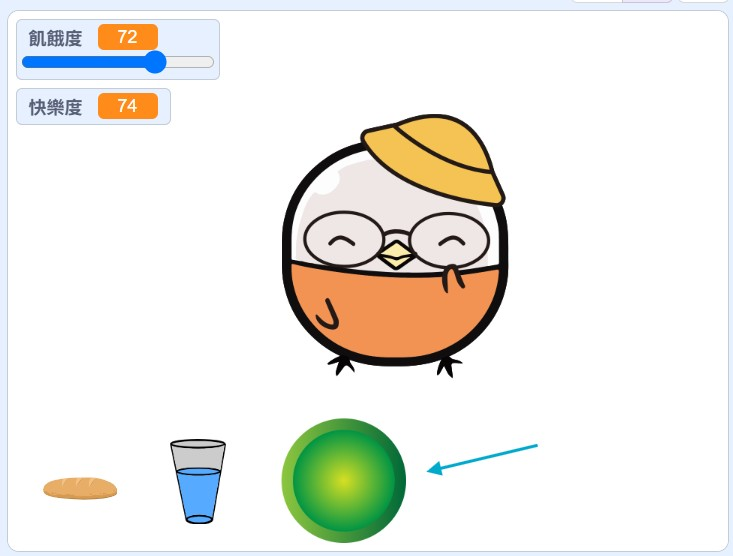
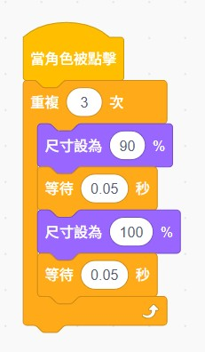
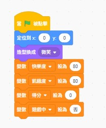
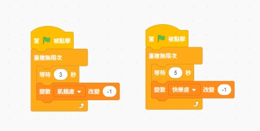
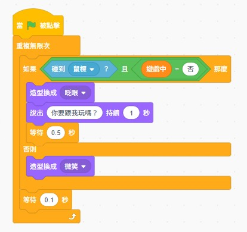
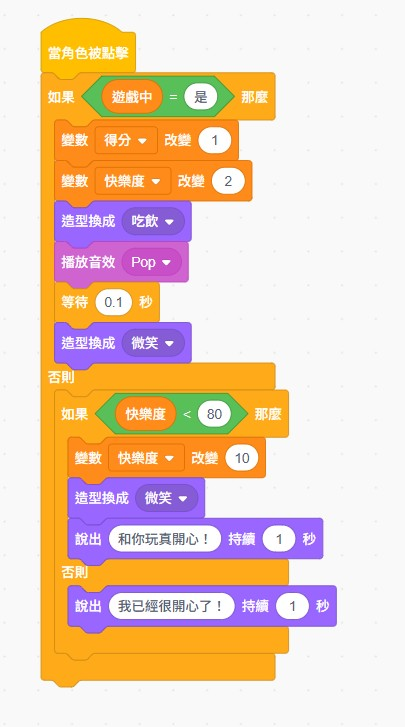
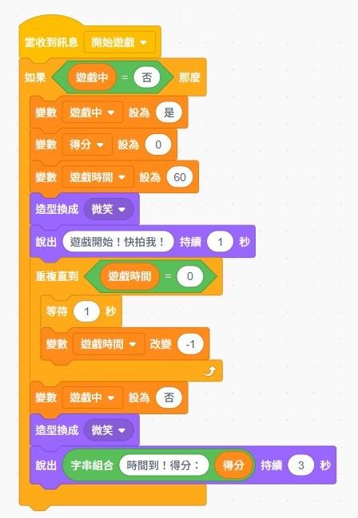
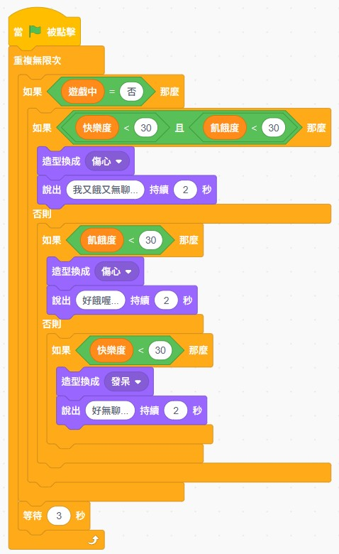
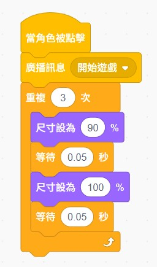

  <h3>📄 這是 A4 列印專用頁面</h3>
  
請使用瀏覽器的「列印」功能（Ctrl+P 或 Cmd+P）列印本頁

  
<strong>建議設定</strong>：選擇 A4 紙張、直向、縮放選「符合頁面」

  <button onclick="window.print()" style="background: #4CAF50; color: white; border: none; padding: 10px 20px; border-radius: 5px; cursor: pointer; font-size: 16px;">🖨️ 立即列印</button>

---

# 🎮 第四週第四部分：1分鐘拍拍樂遊戲

**綜合實作 ⭐ 必做！**

---

## 🎯 本部分目標

我們要把前面學的**條件判斷**、**快樂度**、**滑鼠感應**，全部整合成一個超好玩的遊戲！

**挑戰：1分鐘內，你能點幾下？**

---

## 📊 完整遊戲角色配置

| 角色 | 功能 | 主要程式 |
|------|------|----------|
| **電子雞** | 主角 | 條件判斷 + 滑鼠感應 + 狀態管理 + 計分 |
| **開始遊戲按鈕** | 遊戲控制 | 廣播「開始遊戲」訊息 |

---

## 🎮 Step 1：新增「開始遊戲」按鈕（必做！）

### 步驟1：新增按鈕角色

**操作步驟**：
1. 點擊「選擇一個角色」
2. 搜尋「Button」或繪製一個簡單的按鈕
3. 調整大小（約 100）
4. 放在舞台上方明顯的位置

---

### 步驟2：在「開始遊戲」按鈕中寫程式

**效果**：
- 點擊按鈕 → 發送「開始遊戲」訊息
- 按鈕會有縮放動畫回饋

---

## 📝 完整程式架構

### 🐣 電子雞角色（包含所有功能）

---

### ✅ 程式1：初始化

**說明**：當綠旗被點擊時，設定所有變數的初始值。

---

### ✅ 程式2：飢餓度和快樂度自動下降

**說明**：每隔一段時間，飢餓度和快樂度會自動下降，模擬真實的電子雞。

---

### ✅ 程式3：滑鼠感應

**說明**：當滑鼠接近電子雞時，牠會眨眼並打招呼。

---

### ✅ 程式4：點擊互動（合併版）

**重點**：這個程式整合了「遊戲中的計分」和「平常的互動」兩種功能！

**邏輯流程**：
1. 檢查是否在遊戲中 → 是的話計分
2. 檢查飢餓度 → 太餓就要求餵食
3. 檢查快樂度 → 不夠開心就增加快樂度

---

### ✅ 程式5：1分鐘拍拍樂遊戲模式（必做！）

**說明**：
- 收到「開始遊戲」廣播後啟動
- 遊戲時間設為 60 秒
- 每秒倒數，時間到後顯示得分

---

### 📚 程式6：狀態顯示（複合條件判斷）**選做**

**注意**：這是選做的進階功能，做不完可以之後有時間再做，不影響遊戲主要功能。

**說明**：讓電子雞根據「飢餓度」和「快樂度」的組合顯示不同狀態和表情。

---

### 🎮 開始遊戲按鈕角色

**說明**：點擊後發送「開始遊戲」訊息，並有縮放動畫效果。

---

## 📋 程式清單總結

### ⭐ 必做程式（優先完成這些）：

- [ ] **程式1**：初始化
- [ ] **程式2**：飢餓度和快樂度自動下降
- [ ] **程式3**：滑鼠感應
- [ ] **程式4**：點擊互動
- [ ] **程式5**：1分鐘拍拍樂遊戲模式
- [ ] **開始遊戲按鈕**：按鈕角色程式

### 📚 選做程式（有時間再做）：

- [ ] **程式6**：狀態顯示（複合條件判斷）

---

## 🎯 重點提醒

1. **先完成必做程式**，就可以玩 1 分鐘拍拍樂遊戲了！
2. **程式6 是進階功能**，做不完沒關係，之後有時間再加！
3. **測試很重要**：每完成一個程式就測試一次
4. **遇到問題**：檢查變數名稱、積木顏色、程式順序

---

## 🏆 挑戰目標

- 🥉 **銅牌**：完成遊戲，得分 30 分以上
- 🥈 **銀牌**：完成遊戲，得分 50 分以上
- 🥇 **金牌**：完成遊戲，得分 70 分以上

**加油！挑戰你的最高分！** 💪

---

  <a href="../index.html">← 返回第四週完整課程</a>

