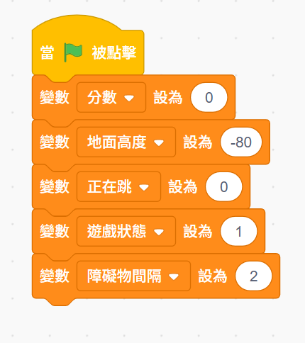
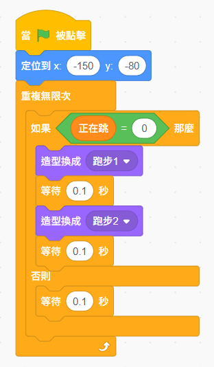
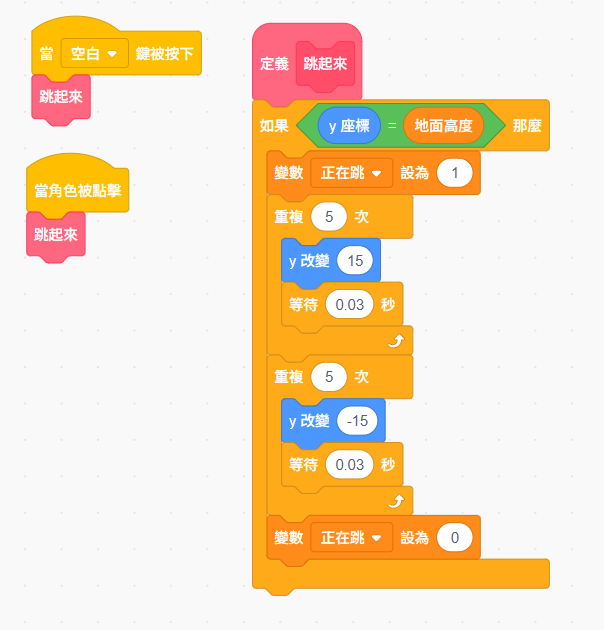
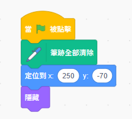
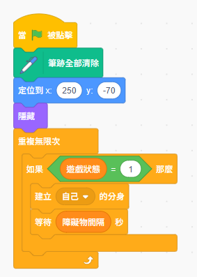
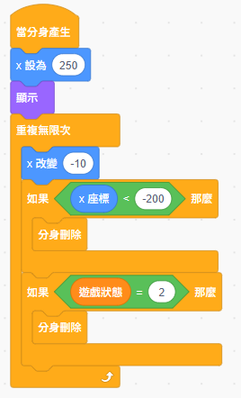
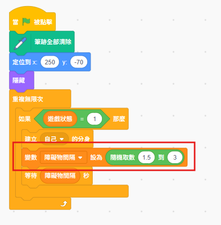
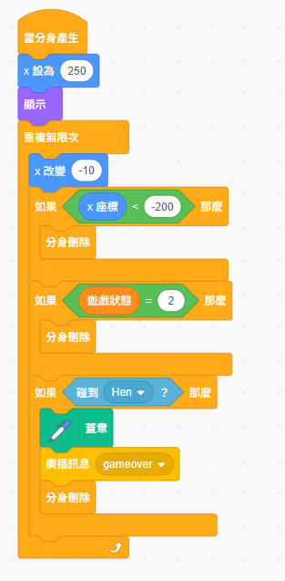
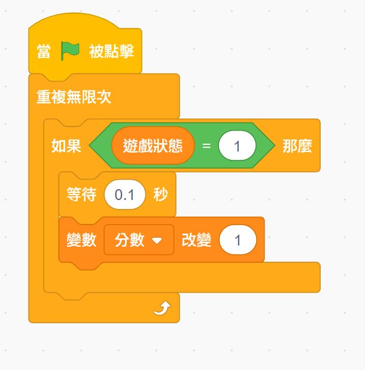
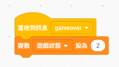

# 🏃 第五點五週:小電子雞跑酷遊戲
{: .fs-9 }

還記得 Chrome 瀏覽器斷網時的小恐龍遊戲嗎？這週我們要製作電子雞版的跑酷遊戲！整合前五週學到的所有技能，完成一個真正完整的遊戲作品！
{: .fs-6 .fw-300 }

[開始學習](#學習內容){: .btn .btn-primary .fs-5 .mb-4 .mb-md-0 .mr-2 } [下載學習單](./worksheets/第五點五週學習單.md){: .btn .fs-5 .mb-4 .mb-md-0 }

---

## 📥 快速開始：下載空白版專案

{: .important }
> **💡 建議先下載空白版專案再開始學習！**
>
> 空白版專案已經幫你準備好：
> - ✅ 小雞角色（Hen）- 已有跑步造型
> - ✅ 大便角色（Poop）- 已調整好大小
> - ✅ 簡單的背景
> - ✅ **不包含任何程式碼** - 讓你從零開始學習！
>
> 這樣可以節省準備時間，專注在程式邏輯的學習！

### 下載連結

- 📦 [第五點五週-空白版.sb3](./resources/第五點五空白版.sb3.sb3) - 點擊下載

### 使用方式

1. **下載檔案**：點擊上方連結下載專案
2. **開啟 Scratch**：前往 [scratch.mit.edu](https://scratch.mit.edu)
3. **載入專案**：
   - 點擊「檔案」→「從你的電腦載入」
   - 選擇剛才下載的檔案
4. **開始學習**：跟著課程內容，一步步完成程式！

{: .highlight }
> **✨ 提醒**
>
> 如果你想完全從頭開始建立角色，也可以不下載空白版，
> 直接新增專案，自己選擇角色和背景！

---

## 🎬 本週遊戲展示

### 🏃 跑酷遊戲玩法

**熟悉又刺激的遊戲體驗**：讓小雞在跑酷中展現活力！

#### 遊戲角色：
- 🐣 **主角**：小雞（Hen）- 會跑步和跳躍的可愛角色
- 💩 **障礙物**：大便（Poop）- 需要跳過的障礙

#### 遊戲機制：
1. **自動奔跑** 🏃
   - 小雞持續在原地跑步
   - 跑步動畫自動播放
   - 大便從右側持續靠近

2. **跳躍閃避** ⬆️
   - 按空白鍵或點擊螢幕跳躍
   - 簡單的跳躍動作
   - 躲避迎面而來的大便

3. **障礙物系統** 💩
   - 大便從右側持續出現
   - 使用分身系統建立
   - 隨機間隔增加挑戰性

4. **計分與挑戰** 🏆
   - 持續計分系統
   - 碰到大便遊戲結束
   - 挑戰自己的最高分

---

## 🎯 為什麼要做這個遊戲？

### 💡 這是一堂「技能整合課」

這不只是一個遊戲，更是前五週所有學習的總複習！

| 使用的技能 | 來自哪一週 | 在遊戲中的應用 |
|-----------|-----------|--------------|
| 造型切換 | 第 2 週 | 電子雞跑步動畫 |
| 事件觸發 | 第 2 週 | 按鍵跳躍、遊戲開始 |
| 變數應用 | 第 3 週 | 分數、遊戲狀態 |
| 廣播訊息 | 第 3 週 | 遊戲結束通知 |
| 條件判斷 | 第 4 週 | 碰撞偵測、遊戲狀態 |
| 分身系統 | 第 5 週 | 障礙物產生 |
| 隨機系統 | 第 5 週 | 障礙物間隔 |

### 🌟 新學習的技能

1. **簡化版重力系統** - 讓跳躍更真實
2. **遊戲循環管理** - 開始→進行→結束→重新開始
3. **完整遊戲架構** - 理解遊戲的完整結構

---

## 📱 iPad 友善設計

{: .important }
> **✅ iPad 完全相容！**
>
> 這個遊戲對 iPad 非常友善：
> - ✅ **點擊跳躍**：點擊螢幕任意位置即可跳躍
> - ✅ **單一操作**：只需要一個動作，簡單直覺
> - ✅ **觸控優先**：不依賴鍵盤，全觸控完成
>
> iPad 和電腦學生都能輕鬆完成！

---

## 🎯 本週學習目標

完成本週學習後，你將能夠：

### 💻 技能目標
- ✅ **整合多項技能**：靈活運用前五週所學的所有技能
- ✅ **掌握跳躍系統**：理解並實作簡化版的重力效果
- ✅ **遊戲循環管理**：設計完整的遊戲流程
- ✅ **分身進階應用**：讓障礙物持續產生並移動
- ✅ **碰撞偵測優化**：精確的遊戲結束判斷

### 🎨 創意目標
- 🌟 **完整遊戲作品**：擁有一個可以分享的完整遊戲
- 🌟 **個人化設計**：設計獨特的障礙物和場景
- 🌟 **難度調整**：學會平衡遊戲的挑戰性

### 🤝 學習目標
- 👥 **系統性思考**：理解遊戲的完整架構
- 👥 **問題解決**：遇到 bug 能自己除錯
- 👥 **成就感培養**：完成複雜專案的信心

---

## 📚 學習內容

### 🎯 準備工作：了解遊戲結構

#### 遊戲需要哪些角色？

1. **小雞角色（Hen）** 🐣
   - 跑步動畫（造型切換）
   - 跳躍功能
   - 碰撞偵測

2. **大便角色（Poop）** 💩
   - 本體（隱藏）
   - 分身（顯示並移動）
   - 碰到小雞時觸發遊戲結束

3. **地面角色**（選做）🌍
   - 視覺效果
   - 移動營造奔跑感

4. **背景** 🌄
   - 簡單的天空或場景

#### 遊戲流程圖


---

### 🎯 第零部分：遊戲初始化（5分鐘）

{: .important }
> **💡 重要觀念：在舞台統一初始化遊戲變數**
>
> 在開始製作角色動畫之前，我們先在**舞台**建立遊戲的初始化程式。
>
> **為什麼要在舞台？**
> - 🎬 **舞台**是遊戲的「管理員」，負責整體控制
> - 🐣 **角色**專注在自己的行為（跑步、跳躍等）
> - ✅ 所有變數在一個地方初始化，容易管理
> - ✅ 避免多個角色重複設定同一個變數

#### 0.1 建立所有需要的變數

點擊 Scratch 左下角的「製作變數」，建立以下變數：

| 變數名稱 | 用途 | 是否顯示 |
|---------|------|---------|
| 遊戲狀態 | 控制遊戲進行（0=未開始，1=進行中，2=結束） | ❌ 不顯示 |
| 分數 | 記錄玩家得分 | ✅ 顯示 |
| 地面高度 | 電子雞站立的 y 座標 | ❌ 不顯示 |
| 正在跳躍 | 控制跑步動畫開關 | ❌ 不顯示 |
| 障礙物間隔 | 障礙物出現的時間間隔 | ❌ 不顯示 |
| 最高分 | 記錄最高分（選做） | ✅ 顯示 |

#### 0.2 舞台的初始化程式

**點擊舞台（Scratch 右下角的舞台圖示），在舞台的程式區建立**：



**程式說明**：
- `分數 = 0`：遊戲開始時分數歸零
- `地面高度 = -80`：設定電子雞站立的地面位置
- `正在跳躍 = 0`：初始狀態在地面（0 = 不在跳躍）
- `遊戲狀態 = 1`：遊戲開始（1 = 進行中，2 = 結束）
- `障礙物間隔 = 2`：障礙物每 2 秒出現一次

{: .highlight }
> **✨ 程式設計小技巧**
>
> 把所有初始化放在舞台，就像遊戲開始前的「準備工作」：
> - 📋 設定好所有規則
> - 🎮 然後讓角色們開始行動！

**測試看看**：
- 點擊綠旗
- 檢查變數區，應該看到「分數 = 0」

---

### 🎯 第一部分：電子雞跑步動畫（15分鐘）

#### 1.1 準備電子雞角色

**步驟 1：選擇或繪製電子雞**
1. 使用你之前創造的電子雞角色
2. 或選擇 Scratch 內建的「Duck」、「Chick」等角色

**步驟 2：創造跑步動畫造型**

你需要 **2 個跑步造型**，讓電子雞看起來在跑步：

1. 點擊「造型」標籤
2. 複製現有造型 2 次
3. 修改兩個造型：
   - **造型 1**：一隻腳在前
   - **造型 2**：另一隻腳在前

**💡 繪製技巧**：
- 只需要改變腿的位置
- 可以簡單的旋轉腿部
- 或使用 Scratch 內建的「Avery Walking」角色作為參考

#### 1.2 程式：跑步動畫

**電子雞角色程式**：



**程式說明**：
- `定位到 x:(-150) y:(-80)`：設定電子雞的起始位置
- `重複無限次`：持續播放跑步動畫
- `如果 正在跳躍 = 0`：只有在地面時才播放跑步動畫
  - 跳躍時會暫停動畫（避免跳躍時腳還在跑）
- `造型換成 跑步1` → `等待 0.1 秒` → `造型換成 跑步2`：製作跑步動畫效果
- `否則 等待 0.1 秒`：跳躍時也要等待，避免程式卡住

{: .note }
> **🎯 注意**：變數「正在跳躍」已經在舞台初始化為 0 了，所以這裡不需要再設定！

{: .important }
> **💡 為什麼需要「正在跳躍」變數？**
>
> 如果沒有這個變數，跑步動畫和跳躍動作會同時進行，造成：
> - ❌ 跳躍時腳還在跑（視覺上不自然）
> - ❌ 兩個程序同時修改造型，產生衝突
>
> 使用「正在跳躍」變數可以：
> - ✅ 跳躍時暫停跑步動畫
> - ✅ 落地後自動恢復跑步動畫

**測試看看**：
- 點擊綠旗
- 電子雞應該會在原地做出跑步動作！

---

### 🎯 第二部分：跳躍系統（20分鐘）

#### 2.1 理解跳躍的原理

**真實的跳躍是怎樣的？**
1. 🔼 往上跳：y 座標持續增加
2. ⏸️ 到達最高點：短暫停留
3. 🔽 落下：y 座標持續減少
4. 🎯 著地：回到地面 y 座標

**在 Scratch 中的實作**：
使用「重複」積木來製作平滑的跳躍！

#### 2.2 理解跳躍相關變數

我們在第零部分已經建立好跳躍需要的變數了：

1. **地面高度** = `-80`
   - 記住電子雞的地面位置
   - 跳躍後知道要回到哪裡

2. **正在跳躍** = `0`
   - 控制是否播放跑步動畫
   - 0 = 在地面跑步，1 = 正在跳躍

{: .note }
> **🎯 提醒**：這些變數已經在舞台統一初始化了，不需要在角色中再設定一次！

#### 2.3 程式：跳躍功能（使用自訂積木）

{: .important }
> **💡 為什麼要使用「自訂積木」？**
>
> 在這個遊戲中，我們有**兩種跳躍方式**：
> - 🎮 電腦玩家：按**空白鍵**跳躍
> - 📱 iPad 玩家：**點擊螢幕**跳躍
>
> 如果不用自訂積木，我們需要寫兩段完全相同的跳躍程式碼！
>
> **使用自訂積木的好處**：
> - ✅ **避免重複**：跳躍邏輯只需要寫一次
> - ✅ **容易維護**：要修改跳躍高度或速度，只要改一個地方
> - ✅ **程式簡潔**：空白鍵和點擊都呼叫同一個「跳起來」積木
> - ✅ **像數學函式**：就像 f(x) 一樣，定義一次，重複使用！

**完整跳躍程式（iPad 友善版）**：



**程式分析**：

1. **兩個觸發方式**：
   - `當 空白 鍵被按下` → 呼叫「跳起來」
   - `當角色被點擊` → 呼叫「跳起來」

2. **自訂積木「跳起來」的邏輯**：
   - 先檢查：`如果 y座標 = 地面高度`（只有在地面才能跳）
   - 設定：`正在跳躍 = 1`（暫停跑步動畫）
   - 往上：`重複 5 次，y 改變 15`（向上跳）
   - 落下：`重複 5 次，y 改變 -15`（落回地面）
   - 復原：`正在跳躍 = 0`（恢復跑步動畫）

3. **為什麼重複 5 次，而不是 10 次？**
   - 重複次數 × y 改變量 = 跳躍高度
   - 5 次 × 15 = 75 像素（適中的跳躍高度）
   - 你可以調整這兩個數字來改變跳躍高度！

**測試看看**：
- 按空白鍵或點擊螢幕
- 電子雞應該會跳起來再落下！

---

### 🎯 第三部分：障礙物系統（20分鐘）

#### 3.1 準備大便角色

**步驟 1：選擇大便造型**

**建議使用 Scratch 內建的「Poop」角色**：
- 💩 搜尋「Poop」找到大便角色
- 符合跑酷遊戲的趣味主題
- 造型簡單，容易識別

**其他選擇**：
- 🌵 仙人掌（Cactus）- 經典跑酷障礙物
- 🪨 石頭（Rocks）
- 🚧 自己畫一個障礙物

**步驟 2：調整大小**
- 縮小到適當大小（建議 40-60%）
- 確保小雞能跳過去

#### 3.2 障礙物的初始設定

**障礙物角色程式**：



**程式說明**：
- `避開全部清除`：確保畫筆不會留下痕跡
- `定位到 x:250 y:-70`：設定在舞台右側、地面上
- `隱藏`：**本體要隱藏**，只顯示分身！

{: .important }
> **💡 重要觀念：本體 vs 分身**
>
> - **本體**：隱藏，負責建立分身
> - **分身**：顯示，真正的障礙物
> - 這是第五週學過的重要概念！

#### 3.3 產生障礙物分身

{: .note }
> **🎯 提醒**：需要的變數（遊戲狀態、障礙物間隔）已經在第零部分的舞台中建立並初始化了！

**障礙物角色新增程式**：



**程式說明**：
- `重複無限次`：持續產生障礙物
- `如果 遊戲狀態 = 1`：只有遊戲進行中才產生
- `建立自己的分身`：建立一個新的障礙物分身
- `等待 障礙物間隔 秒`：使用舞台設定的間隔時間（2 秒）

{: .highlight }
> **✨ 程式簡化了！**
>
> 因為變數已經在舞台初始化，障礙物角色只需要：
> - 隱藏自己
> - 持續產生分身
> - 不用擔心變數設定！

#### 3.4 分身的移動與刪除

**障礙物角色新增程式**：



**程式說明**：
- `當分身產生`：這是分身專用的程式起點
- `x 座標設為 250`：每個分身從舞台右側開始
- `顯示`：分身要顯示出來（本體是隱藏的）
- `重複無限次`：持續移動
  - `x 改變 -10`：向左移動
  - `如果 x 座標 < -200`：移出舞台左側就刪除分身
  - `如果 遊戲狀態 = 2`：遊戲結束時刪除所有分身

**測試看看**：
- 點擊綠旗
- 應該每 2 秒從右側出現一個障礙物
- 障礙物會向左移動直到消失

#### 3.5 讓遊戲更有挑戰性（選做）

目前大便每 2 秒固定出現一次，玩家很容易掌握節奏。
如果讓間隔**隨機變化**，遊戲會更有挑戰性！

**修改大便角色的分身產生程式**：



**程式說明**：
- 紅框處是關鍵：`變數 障礙物間隔 設為 隨機取數(1.5)到(3)`
- 每次產生分身後，隨機決定下一個大便出現的時間
- 可能是 1.5 秒、2 秒、2.5 秒或 3 秒
- 讓玩家無法預測，增加遊戲難度

{: .note }
> **💡 調整難度**
>
> - **簡單**：隨機取數(2)到(3) - 間隔較長
> - **普通**：隨機取數(1.5)到(3) - 圖片中的設定
> - **困難**：隨機取數(1)到(2) - 間隔較短，很有挑戰性！

---

### 🎯 第四部分：碰撞偵測與計分（15分鐘）

#### 4.1 建立遊戲變數

**需要的變數**：
1. **分數** - 顯示在舞台上 ✓
2. **遊戲狀態** - 不顯示
3. **最高分** - 顯示在舞台上 ✓（選做）

#### 4.2 碰撞偵測與畫筆蓋章

{: .important }
> **💡 新技能：使用畫筆「蓋章」功能**
>
> 當電子雞撞到障礙物時，我們希望玩家清楚看到：
> - ❌ **不好的方式**：只是遊戲停止，玩家不知道撞到了什麼
> - ✅ **好的方式**：障礙物在碰撞位置「蓋章」，留下印記
>
> **蓋章是什麼？**
> - 就像真的印章一樣，在舞台上留下角色的圖案
> - 這個圖案會永久留在舞台上（除非清除）
> - 讓玩家清楚看到碰撞發生的位置！

**回到障礙物角色，修改分身程式**：



**程式說明**：
- `當分身產生`：分身開始的程式
- `x 座標設為 250`、`顯示`：從右側出現
- `重複無限次`：持續移動和檢測
  - `x 改變 -10`：向左移動
  - **碰撞檢測**：`如果 碰到 Hen`（Hen 是電子雞角色名稱）
    - **🎨 蓋章**：在碰撞位置留下障礙物的印記
    - **📢 廣播 gameover**：通知遊戲結束
    - **刪除此分身**：障礙物消失
  - `如果 x 座標 < -200`：移出舞台就刪除
  - `如果 遊戲狀態 = 2`：遊戲結束時刪除所有分身

{: .note }
> **🔧 重要提醒**：
> - 確保你的電子雞角色名稱是「Hen」
> - 如果名稱不同，請在「碰到 [ ] ?」積木中選擇正確的角色名稱
> - 蓋章功能在「擴充功能」→「畫筆」中

#### 4.3 計分系統

**在舞台新增程式**（點擊舞台，在現有初始化程式後面新增）：



**程式說明**：
- `重複無限次`：持續計分
- `如果 遊戲狀態 = 1`：只有遊戲進行中才計分
- `等待 0.1 秒`：每 0.1 秒執行一次
- `變數 分數 改變 1`：分數增加 1 分

{: .note }
> **🎯 注意**：分數和遊戲狀態已經在舞台的第一個程式中初始化了（分數=0，遊戲狀態=1），這裡只需要負責持續加分！

{: .highlight }
> **✨ 為什麼計分放在舞台？**
>
> - 舞台是遊戲的「管理員」，負責計分很合理
> - 不需要額外建立計分器角色，簡化專案結構
> - 所有遊戲邏輯集中管理，容易維護

#### 4.4 遊戲結束處理（簡化版）

{: .important }
> **💡 簡化遊戲結束邏輯**
>
> 這週我們使用**最簡單的遊戲結束方式**：
> - ✅ 畫面停住（所有角色停止移動）
> - ✅ 分數停止計算
> - ✅ 大便在碰撞位置留下蓋章
> - ✅ 按綠旗重新開始
>
> **為什麼這樣設計？**
> - 專注在畫筆蓋章這個新技能
> - 避免程式過於複雜
> - 玩家可以清楚看到碰撞位置

**遊戲結束需要兩個角色配合**：

**1️⃣ 在舞台新增程式**：



**程式說明**：
- 當收到 `gameover` 訊息（大便碰撞時廣播）
- 設定 `遊戲狀態 = 2`：
  - **計分系統會停止**（因為只在遊戲狀態 = 1 時計分）
  - **大便不再產生新分身**（因為只在遊戲狀態 = 1 時產生）
  - **所有大便分身會自動刪除**

**2️⃣ 在小雞角色新增程式**：


**程式說明**：
- 當收到 `gameover` 訊息
- `停止 這個角色的其他程序`：停止跑步和跳躍程序
- **畫面會停住，玩家可以看到碰撞位置的蓋章！**

**就這麼簡單！**

{: .highlight }
> **✨ 為什麼分成兩個角色？**
>
> - **舞台**：負責管理遊戲狀態（計分、障礙物產生）
> - **小雞**：負責自己的行為（停止跑步和跳躍）
> - 這樣分工清楚，程式容易理解和維護！

#### 4.5 重新開始

**最簡單的方式：按綠旗重新開始**

遊戲結束後，只需要按**綠旗**就能重新開始！

{: .note }
> **💡 為什麼這樣就夠了？**
>
> 因為我們在舞台的初始化程式中已經設定好：
> - `分數 = 0`：分數會重置
> - `遊戲狀態 = 1`：遊戲重新開始
> - 畫筆會全部清除（在障礙物的初始化中）
>
> 所以按綠旗就會自動重置所有設定！

{: .highlight }
> **✨ 想挑戰進階版？**
>
> 如果你想做一個「重新開始按鈕」（按空白鍵重新開始），
> 可以參考本頁最後面的「延伸學習」區！

---

## 🎉 恭喜！基本遊戲完成了！

{: .highlight }
> **✨ 你已經完成了小雞跑酷遊戲的核心功能！**
>
> 現在你的遊戲已經可以玩了：
> - ✅ 小雞會跑步
> - ✅ 可以跳躍閃避
> - ✅ 大便持續出現
> - ✅ 碰撞會留下蓋章
> - ✅ 分數持續計算
> - ✅ 遊戲結束後按綠旗重新開始
>
> **這是一個完整的遊戲了！** 🎮

---

## 📋 全部的程式

{: .important }
> **💡 完整程式總覽**
>
> 這裡整理了遊戲中所有角色的程式積木，方便你檢查和對照！
> 按照角色分類，一目瞭然！

### 🐣 主角：小雞（Hen）

#### 跑步動畫程式


#### 跳躍程式（iPad友善版）


#### 遊戲結束處理


---

### 💩 障礙物：大便（Poop）

#### 初始設定（隱藏本體）


#### 產生分身程式


#### 分身移動與刪除


#### 分身碰撞偵測（含蓋章）


#### 隨機間隔（選做）


---

### 🎬 舞台（Stage）

#### 遊戲初始化程式


#### 計分系統


#### 遊戲結束處理


{: .highlight }
> **✨ 檢查清單**
>
> 對照上面的程式,確認你的遊戲：
> - ✅ **小雞**：跑步動畫、跳躍、遊戲結束 3 個程式
> - ✅ **障礙物**：初始化、產生分身、分身移動、碰撞偵測 4-5 個程式
> - ✅ **舞台**：初始化、計分、遊戲結束 3 個程式
>
> 如果有遺漏,回到前面的章節補上吧！

---

## 📚 本週課程總結

### ✅ 你學會了什麼？

#### 新技能
1. **自訂積木**
   - 避免程式碼重複
   - 讓程式更簡潔易懂
   - 空白鍵和點擊都能跳躍

2. **畫筆蓋章功能** ⭐ 重點！
   - 在舞台上留下印記
   - 清楚標示碰撞位置
   - 增強遊戲視覺回饋

3. **遊戲狀態管理**
   - 用變數控制遊戲流程
   - 舞台統一管理遊戲邏輯
   - 角色各司其職

#### 整合的技能
- 🎨 造型切換（第 2 週）→ 跑步動畫
- 🎯 事件觸發（第 2 週）→ 跳躍控制
- 📊 變數應用（第 3 週）→ 計分系統
- 📢 廣播訊息（第 3 週）→ 遊戲結束通知
- 🔍 條件判斷（第 4 週）→ 碰撞偵測
- 👥 分身系統（第 5 週）→ 大便產生
- 🎲 隨機系統（第 5 週）→ 障礙間隔

{: .note }
> **💡 這就是技能整合的力量！**
>
> 你已經能夠把前五週學到的所有技能，
> 組合成一個完整的遊戲作品！

---

## 🎓 完成檢核表

{: .important }
> **📋 課堂討論時間**
>
> 完成遊戲後，讓我們一起檢查看看：
> - ✅ 哪些功能已經完成了？
> - 🤔 遇到什麼困難？
> - 💡 有什麼創意想法？

**基本功能**（必須完成）：
- ☐ 電子雞跑步動畫正常
- ☐ 按空白鍵或點擊可以跳躍
- ☐ 障礙物持續從右側出現
- ☐ 碰到障礙物會遊戲結束
- ☐ 計分系統正常運作
- ☐ 可以重新開始遊戲

**進階功能**（挑戰自己）：
- ☐ 加入音效
- ☐ 最高分記錄
- ☐ 移動的地面或背景
- ☐ 難度遞增
- ☐ 特殊道具

---

## 🔮 下週預告：第六週課程

### 🚽 第六週：自己的便便自己清

下週我們將學習：

#### 💩 便便系統
- 電子雞吃東西會產生便便
- 便便太多會影響快樂度
- 學習清理維持環境衛生

#### 👥 進階分身應用
- 建立多個獨立運作的分身
- 對分身進行個別控制
- 批次管理和清理分身

#### ⏱️ 計時器系統
- 建立計時器變數
- 設定定時事件
- 時間到自動觸發

{: .highlight }
> **✨ 這週學的分身技巧，下週會派上大用場！**
>
> 便便系統也是用分身來製作的，
> 你已經掌握核心技術了！

---

### 🎯 第五部分：優化與完善（選做）

#### 5.1 音效設計

**跳躍音效**：

```scratch
定義 開始跳躍
如果 <(y座標) = (地面高度)> 那麼
  播放音效 [jump v]                 ← 加入跳躍音效
  （跳躍程式...）
結束
```

**碰撞音效**：

```scratch
當收到訊息 [遊戲結束 v]
播放音效 [lose v]                   ← 遊戲結束音效
變數 [遊戲狀態 v] 設為 [2]
（其他程式...）
```

**計分音效**（每 10 分一次）：

```scratch
重複無限次
  如果 <(遊戲狀態) = [1]> 那麼
    等待 [0.1] 秒
    變數 [分數 v] 改變 [1]

    如果 <((分數) 除以 (10)) = ((分數) 除以 (10) 的四捨五入)> 那麼
      播放音效 [coin v]             ← 每 10 分播放音效
    結束
  結束
結束
```

#### 5.2 視覺效果：移動的地面（選做）

{: .note }
> **💡 進階視覺效果**
>
> 如果時間允許，你可以加入移動的地面來營造奔跑感：
> - 建立一個地面角色
> - 讓地面持續向左移動
> - 移出畫面後重置位置，形成循環
>
> 這部分需要使用進階的分身技巧，如果感興趣可以自己研究看看！

#### 5.3 難度遞增

讓遊戲越來越難：

```scratch
當綠旗被點擊
變數 [遊戲速度 v] 設為 [10]        ← 初始速度

重複無限次
  如果 <(分數) > [100]> 那麼        ← 分數超過 100
    變數 [遊戲速度 v] 設為 [12]     ← 加快速度
  結束
  如果 <(分數) > [200]> 那麼
    變數 [遊戲速度 v] 設為 [15]
  結束
結束
```

然後在障礙物移動時使用「遊戲速度」變數：

```scratch
當分身產生
重複無限次
  x 改變 (遊戲速度) * [-1]          ← 使用變數控制速度
結束
```

---

## 💡 進階思考題

{: .highlight }
> **🤔 挑戰問題：如何做到「點擊背景」就能跳躍？**
>
> 現在我們的遊戲是「點擊電子雞」才能跳躍，但有些同學可能會覺得：
> - 🎮 電子雞太小，不好點
> - 🎮 希望點擊螢幕任意位置都能跳
>
> **問題**：怎麼做才能讓「點擊背景」也能讓電子雞跳躍呢？

### 🔍 思考提示（由淺入深）

<details>
<summary><strong>💡 提示 1：Scratch 有哪些「點擊」相關的事件？</strong>（點擊展開）</summary>

在 Scratch 中，跟點擊有關的事件積木有：
- 🖱️ **當這個角色被點擊** - 在角色中使用
- 🖱️ **當舞台被點擊** - 在舞台中使用

現在我們用的是「當這個角色被點擊」，如果要點擊背景...應該用哪一個？
</details>

<details>
<summary><strong>💡 提示 2：「當舞台被點擊」要放在哪裡？</strong>（點擊展開）</summary>

「當舞台被點擊」這個積木要放在**舞台的程式區**！

但是...問題來了：
- ✅ 自訂積木「開始跳躍」在電子雞角色中
- ❌ 舞台無法直接呼叫角色的自訂積木

怎麼辦？🤔
</details>

<details>
<summary><strong>💡 提示 3：還記得第三週學的「廣播訊息」嗎？</strong>（點擊展開）</summary>

在第三週我們學過：
- 📢 **廣播訊息**可以讓不同角色之間溝通
- 📢 一個角色發送廣播，其他角色收到後執行動作

那麼...
- 🎯 **舞台**可以發送什麼訊息？
- 🎯 **電子雞**收到訊息後要做什麼？

試著想想看！
</details>

<details>
<summary><strong>💡 提示 4：完整解答</strong>（點擊展開）</summary>

**在舞台中新增程式**：
```scratch
當舞台被點擊
廣播訊息 [跳躍 v]          ← 發送「跳躍」訊息
```

**在電子雞角色中新增程式**：
```scratch
當收到訊息 [跳躍 v]        ← 收到訊息就跳躍
開始跳躍
```

這樣就完成了！
- ✅ 點擊電子雞：觸發「當這個角色被點擊」→ 跳躍
- ✅ 點擊背景：觸發「當舞台被點擊」→ 廣播「跳躍」→ 電子雞收到訊息 → 跳躍
- ✅ 按空白鍵：觸發「當空白鍵被按下」→ 跳躍

**三種方式都能跳躍，iPad 更好玩！** 🎉
</details>

---

## 🎨 創意挑戰

### 🌟 初級挑戰
1. **更換障礙物造型**：設計 2-3 種不同的障礙物
2. **添加音效**：跳躍、得分、遊戲結束音效
3. **背景設計**：畫一個漂亮的背景

### ⭐ 中級挑戰
1. **雙重障礙物**：
   - 地面障礙物（需要跳過）
   - 空中障礙物（需要蹲下或不跳）

2. **收集道具**：
   - 愛心道具：碰到加分
   - 星星道具：短暫無敵

3. **角色造型切換**：
   - 跑步造型
   - 跳躍造型
   - 遊戲結束造型

### 🌟 高級挑戰
1. **多角色選擇**：
   - 開始前選擇不同的電子雞角色
   - 不同角色有不同跳躍高度

2. **成就系統**：
   - 第一次達到 50 分
   - 第一次達到 100 分
   - 完美跳躍（連續跳過 10 個障礙物）

3. **關卡系統**：
   - 每 100 分切換場景
   - 不同場景有不同障礙物

---

## 📝 重點複習

### 🔑 技能整合
這個遊戲用到了：
1. ✅ **造型切換**（第 2 週）- 跑步動畫
2. ✅ **事件觸發**（第 2 週）- 按鍵跳躍
3. ✅ **變數**（第 3 週）- 分數、遊戲狀態
4. ✅ **廣播**（第 3 週）- 遊戲結束通知
5. ✅ **條件判斷**（第 4 週）- 碰撞、遊戲狀態
6. ✅ **分身系統**（第 5 週）- 障礙物產生
7. ✅ **隨機**（第 5 週）- 障礙物間隔

### 🔑 新技能
1. **跳躍系統**：使用重複積木製作平滑跳躍
2. **遊戲循環**：開始→進行→結束→重啟
3. **自訂積木**：簡化重複的程式碼

### 🔑 程式設計重點
1. **模組化思考**：每個功能獨立設計
2. **狀態管理**：用變數控制遊戲狀態
3. **除錯技巧**：分步測試每個功能

---

## 💡 常見問題與除錯

### Q1: 電子雞跳躍後飛到天上回不來？
**A**: 檢查跳躍程式中：
- 往上和往下的重複次數是否相同
- 最後有沒有「y 座標設為 (地面高度)」

### Q2: 障礙物不會移動？
**A**: 檢查：
- 「當分身產生」的程式是否正確
- 「x 改變 [-10]」是否在「重複無限次」裡面
- 遊戲狀態是否為 1

### Q3: 按空白鍵可以跳，但點擊螢幕無法跳？
**A**: 確認：
- 有沒有加入「當舞台被點擊」的程式
- 或使用自訂積木整合兩種觸發方式

### Q4: 遊戲結束後障礙物還在移動？
**A**: 檢查障礙物分身程式中：
- 有沒有偵測「遊戲狀態 = 2」
- 偵測到時有沒有「刪除此分身」

### Q5: 電子雞可以無限跳（空中二連跳）？
**A**: 檢查跳躍程式開頭：
- 有沒有「如果 <(y座標) = (地面高度)> 那麼」
- 確保只有在地面才能跳

### Q6: 分數增加太快或太慢？
**A**: 調整計分器的等待時間：
- 等待時間越短，分數增加越快
- 建議範圍：0.05 秒到 0.2 秒

### Q7: 電子雞跳躍時腳還在跑？造型一直閃爍？
**A**: 這是因為跑步動畫和跳躍功能同時在修改造型！
- 檢查是否建立了「正在跳躍」變數
- 確認跑步動畫程式中有「如果 <(正在跳躍) = [0]> 那麼」的判斷
- 確認跳躍程式開始時設定「正在跳躍 = 1」
- 確認跳躍程式結束時設定「正在跳躍 = 0」
- 參考第一部分 1.2 和第二部分 2.3 的完整程式碼

---

## 🚀 下週預告

**第六週：自己的便便自己清**

學會了完整的遊戲製作後，下週我們要回到電子雞照護主題：
- 進階分身系統應用
- 計時器的使用
- 讓電子雞的生活更真實！

---

## 🚀 延伸學習（挑戰）

{: .highlight }
> **✨ 這個部分是給想要挑戰進階技巧的同學！**
>
> 如果你已經完成基本遊戲，可以嘗試以下進階功能：
> - 重新開始按鈕（按空白鍵重啟遊戲）
> - 其他創意功能

---

### 🌟 進階挑戰：重新開始按鈕

目前我們按綠旗重新開始，但你可以做一個**空白鍵重新開始**的功能！

{: .important }
> **💡 重要觀念：無法在程式中觸發「綠旗點擊」**
>
> 「當綠旗被點擊」是一個**事件觸發器**，只能作為程式的起點。
> 我們無法在程式中「呼叫」或「觸發」綠旗點擊。
>
> **正確的做法**：
> - ✅ 重新設定所有變數到初始狀態
> - ✅ 使用自訂積木封裝初始化邏輯

**實作步驟**：

**步驟 1：在舞台建立自訂積木「初始化遊戲」**

```scratch
定義 初始化遊戲
變數 [遊戲狀態 v] 設為 [1]
變數 [分數 v] 設為 [0]
變數 [地面高度 v] 設為 [-80]
變數 [正在跳躍 v] 設為 [0]
變數 [障礙物間隔 v] 設為 [2]
```

**步驟 2：在舞台的初始化程式中呼叫**

```scratch
當綠旗被點擊
初始化遊戲                           ← 呼叫自訂積木
```

**步驟 3：在舞台新增重新開始程式**

```scratch
當收到訊息 [重新開始 v]
初始化遊戲                           ← 呼叫同一個初始化積木
```

**步驟 4：在電子雞角色新增按鍵觸發**

```scratch
當 [空白 v] 鍵被按下
如果 <(遊戲狀態) = [2]> 那麼         ← 只有遊戲結束時才能重新開始
  廣播訊息 [重新開始 v]
  定位到 x:(-150) y:(-80)            ← 回到起始位置
結束
```

**完成！**

現在你的遊戲有兩種重新開始方式：
- 🎮 **按綠旗**：隨時可以重新開始
- ⌨️ **按空白鍵**：遊戲結束後按空白鍵重新開始（更方便！）

{: .highlight }
> **✨ 自訂積木的威力**
>
> 使用自訂積木的好處：
> - 避免程式碼重複
> - 綠旗點擊和重新開始都呼叫同一個「初始化遊戲」積木
> - 未來要修改初始化邏輯，只需要改一個地方！

---

## 🌟 進階挑戰：更真實的跳躍（變速跳躍）

{: .highlight }
> **✨ 給還有時間的同學**
>
> 如果你已經完成基本遊戲，而且還有時間，
> 可以挑戰看看這個進階功能！
>
> 這會讓你的遊戲跳躍更真實、更流暢！

目前我們的跳躍是**等速**的：
- 往上：每次 y 改變 +15
- 落下：每次 y 改變 -15

但真實世界的跳躍是**變速**的：
- 往上時，速度會越來越慢（受重力影響）
- 到達最高點時，速度 = 0
- 落下時，速度會越來越快

**實作變速跳躍**：

**需要額外建立的變數**：
- **跳躍速度** - 用來模擬重力效果（不顯示）

**修改自訂積木「跳起來」**：

```scratch
定義 跳起來
如果 <(y座標) = (地面高度)> 那麼
  變數 [正在跳躍 v] 設為 [1]        ← 暫停跑步動畫
  變數 [跳躍速度 v] 設為 [20]        ← 初始向上速度

  重複無限次
    y 改變 (跳躍速度)                 ← 使用變數控制移動
    變數 [跳躍速度 v] 改變 [-2]      ← 模擬重力，速度遞減

    如果 <(y座標) < (地面高度)> 那麼  ← 回到地面
      y 座標設為 (地面高度)
      變數 [正在跳躍 v] 設為 [0]    ← 恢復跑步動畫
      停止 [這個程序 v]
    結束

    等待 [0.03] 秒
  結束
結束
```

**程式解析**：
1. `跳躍速度 = 20`：初始向上速度很快
2. 每次迴圈：
   - `y 改變 (跳躍速度)`：依照目前速度移動
   - `跳躍速度 改變 -2`：速度遞減（模擬重力）
3. 速度變化過程：
   ```
   20 → 18 → 16 → 14 → ... → 0（最高點）→ -2 → -4 → ...（開始落下）
   ```
4. 當 y 座標回到地面時停止

**為什麼這樣更真實？**
- ✅ 跳躍時有「加速」和「減速」的感覺
- ✅ 最高點會有短暫停留的感覺
- ✅ 更符合物理規律，遊戲感覺更流暢

---

## 📚 補充資源

### 📄 下載資源

#### Scratch 專案檔案

**完整版專案**（已完成所有功能）：
- 🎯 [第五點五週-完整版.sb3](./resources/第五點五完整版.sb3.sb3) - 完整遊戲專案

{: .note }
> **💡 完整版專案的用途**
>
> - ✅ **參考答案**：如果卡住了，可以打開看看正確的程式怎麼寫
> - ✅ **學習研究**：研究完整的程式架構和邏輯
> - ✅ **展示作品**：直接使用完成品展示給家人朋友
>
> **建議**：先自己完成課程內容，有問題再參考完整版！

**學習單**：
- [第五點五週學習單](./worksheets/第五點五週學習單.md)

### 🎮 遊戲設計靈感
- Chrome 小恐龍遊戲（按 F12 → Network → Offline 試玩）
- Flappy Bird（類似的跳躍遊戲）
- Temple Run（跑酷遊戲）

### 💡 進階閱讀
- Scratch 官方：遊戲設計教學
- 如何設計平衡的遊戲難度
- 遊戲音效的選擇與應用

---

**🎉 恭喜你完成了第一個完整的跑酷遊戲！你已經能夠整合多項技能，製作出真正的遊戲作品了！**

**💪 挑戰自己**：能不能讓遊戲更有趣？更有挑戰性？發揮你的創意吧！

[返回首頁](../index.html){: .btn .btn-primary } [第五週內容](../week5/){: .btn } [第六週內容](../week6/){: .btn }
