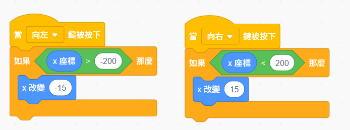
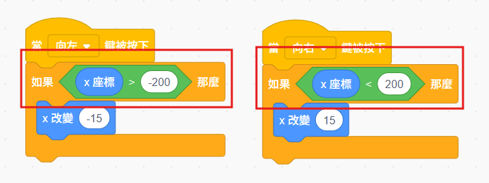
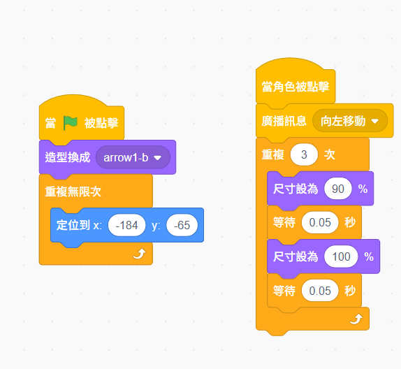
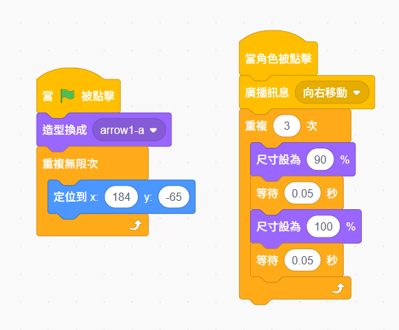
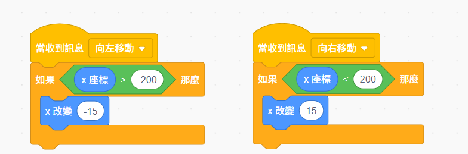
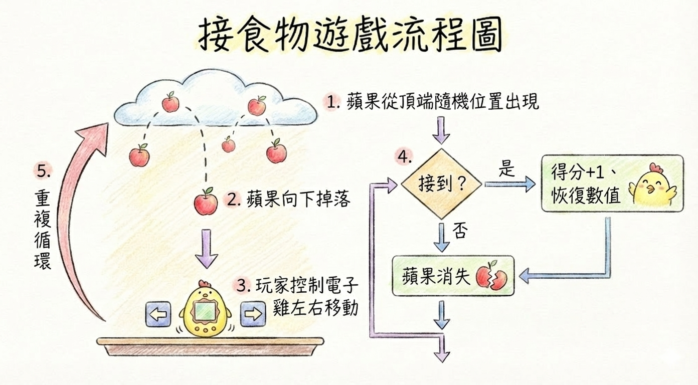
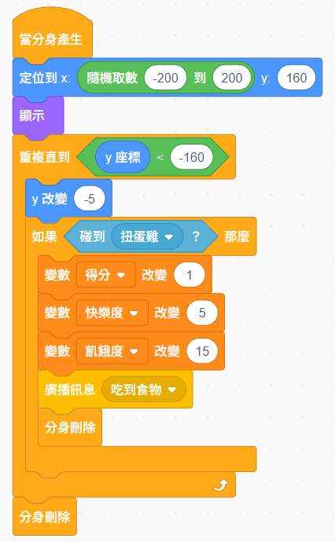

# 🎮 第五週：接食物遊戲：讓電子雞動起來
{: .fs-9 }

電子雞學會感應和判斷了，現在該讓牠真正「動」起來！這週我們要做一個超好玩的接食物遊戲，讓你用鍵盤或觸控螢幕控制電子雞左右移動，接住從天而降的食物！
{: .fs-6 .fw-300 }

[開始學習](#學習內容){: .btn .btn-primary .fs-5 .mb-4 .mb-md-0 .mr-2 } [下載學習單](./worksheets/第五週學習單.md){: .btn .fs-5 .mb-4 .mb-md-0 }

---

## 🎯 本週學習目標

完成本週學習後，你將能夠：

### 💻 技能目標
- ✅ **鍵盤控制**：學會用左右鍵控制角色移動
- ✅ **觸控控制**：讓 iPad 使用者也能輕鬆操作
- ✅ **隨機系統**：學會使用隨機數製造驚喜
- ✅ **分身基礎**：認識分身的建立與刪除（簡化版）
- ✅ **碰撞偵測**：判斷角色是否碰到物件
- ✅ **座標概念**：理解 X、Y 座標與移動範圍

### 🎨 創意目標
- 🌟 **設計接食物遊戲**：創造有趣的掉落遊戲
- 🌟 **調整遊戲難度**：設計適合的速度和頻率
- 🌟 **視覺回饋設計**：讓遊戲有更好的互動感

### 🤝 邏輯目標
- 👥 **空間思維**：理解二維座標系統
- 👥 **隨機概念**：掌握機率與隨機性
- 👥 **遊戲平衡思考**：設計好玩又不會太難的遊戲

---

## 📱 iPad 友善設計

{: .important }
> **🎉 本週特別注意！iPad 學生也能輕鬆玩！**
>
> 我們設計了**觸控按鈕**，iPad 學生點擊螢幕上的箭頭就能控制電子雞移動！
> 電腦學生也可以用鍵盤的左右鍵，兩種方式都很方便！

---

## 🎬 本週遊戲展示

### 🍎 接食物遊戲玩法

1. **食物從天而降** 🍎
   - 蘋果從舞台上方隨機位置掉落
   - 掉落速度固定，但位置不同

2. **控制電子雞移動** ⬅️➡️
   - **電腦**：按左右方向鍵
   - **iPad**：點擊螢幕上的左右箭頭按鈕

3. **接住食物得分** ⭐
   - 電子雞接到食物 → 得分 +1
   - 飢餓度恢復 +15
   - 快樂度增加 +5

4. **食物掉到地上** ❌
   - 沒接到的食物消失
   - 自動產生新的食物

---

## 📚 學習內容

### 🎯 第一部分：隨機數系統（基礎魔法）

#### 1.1 什麼是隨機數？

**生活中的隨機**：
- 🎲 **擲骰子**：每次都不知道會出現幾點
- 🎰 **抽獎**：不知道會抽到什麼獎品
- 🎪 **猜拳**：對手出什麼你無法預測

**在 Scratch 中**：
```scratch
隨機取數 (1) 到 (6)    ← 就像擲骰子
```

#### 1.2 隨機數的用途

**在我們的遊戲中**：
- 🍎 **食物的出現位置**：隨機 X 座標
- ⏰ **食物的出現時間**：隨機等待秒數（進階）
- 🎁 **特殊獎勵**：隨機出現特別的食物（挑戰）

#### 1.3 實作：讓食物隨機出現

**重點積木：隨機取數**


**程式解析**：
- `隨機取數 (-220) 到 (220)`：隨機選擇 X 位置
- 蘋果會從舞台上方隨機位置掉落
- 每次位置都不同，增加遊戲變化

---

### 🕹️ 第二部分：電子雞移動控制（主要重點）

#### 2.1 認識座標系統

**Scratch 的座標**：


**電子雞的活動範圍**：
- **X 座標**：-200 到 200（左右移動）
- **Y 座標**：固定在 -130（在舞台下方）

#### 2.2 方法一：鍵盤控制（電腦適用）

**電子雞角色的程式**：



**程式說明**：
- 按左鍵 → X 座標減少（向左移）
- 按右鍵 → X 座標增加（向右移）
- 邊界限制：防止電子雞跑出舞台



**為什麼要限制範圍？**
- 不限制 → 電子雞會跑出舞台外看不見
- 有限制 → 電子雞只能在看得見的地方移動

**💡 測試看看**：
1. 先不加邊界判斷，看電子雞會不會跑出去
2. 再加上邊界限制，看是不是被限制住了

#### 2.3 方法二：觸控按鈕控制（iPad 友善）

**步驟 1：新增左箭頭按鈕**

1. 點擊「選擇一個角色」
2. 搜尋「Arrow」或「Button」
3. 選擇一個向左的箭頭
4. 調整大小（約 80）
5. 放在舞台左下角

**步驟 2：新增右箭頭按鈕**

1. 再新增一個箭頭角色
2. 點擊「造型」分頁
3. 選擇「水平翻轉」（讓箭頭朝右）
4. 放在舞台右下角

**步驟 3：在「左箭頭」角色中寫程式**



**步驟 4：在「右箭頭」角色中寫程式**



**程式說明**：
- 當按鈕被點擊 → 廣播訊息
- 重複改變大小 → 產生「按下」的視覺效果

**步驟 5：在「電子雞」角色中接收訊息**



**程式說明**：
- 接收到「向左移動」訊息 → 電子雞向左移
- 接收到「向右移動」訊息 → 電子雞向右移
- 同樣有邊界限制

**這樣設計的好處**：
- ✅ **iPad 學生**：直接點螢幕箭頭
- ✅ **電腦學生**：也可以用滑鼠點，或用鍵盤
- ✅ **視覺回饋**：箭頭會有「縮放」動畫，知道有按到

---

### 🍎 第三部分：碰撞偵測與得分

#### 3.1 偵測電子雞是否接到食物



**重點：在「蘋果」角色中偵測碰撞**


**程式說明**：
- 蘋果掉落時持續檢查
- 如果碰到電子雞 → 廣播「吃到蘋果」訊息
- 然後刪除這個分身

.png)

#### 3.2 電子雞的反應

**在「電子雞」角色中接收訊息**：

.png)

**程式說明**：
- 接收到「吃到蘋果」訊息
- 更新分數、飢餓度、快樂度
- 播放音效和對話

#### 3.3 建立得分變數

**操作步驟**：
1. 點擊「變數」分類
2. 點擊「建立一個變數」
3. 輸入名稱：`得分`
4. 選擇「適用於所有角色」
5. 勾選顯示

---

### 🔄 第四部分：分身系統入門（簡化版）

{: .note }
> **💡 什麼是分身？**
>
> 想像你有一個模具，可以「複製」出很多一模一樣的蘋果！
> - **原始角色**：就像模具
> - **分身**：就像用模具做出來的複製品
> - 每個分身都可以獨立活動


#### 4.1 為什麼需要分身？

**沒有分身**：
- 同時只能有一個蘋果掉落
- 遊戲太簡單，不刺激

**有分身**：
- 可以同時有很多蘋果掉落
- 遊戲更有挑戰性！

#### 4.2 簡化版分身（本週學這個就好）

**步驟 1：建立分身**

在蘋果角色的本體中，每 2 秒建立一個分身：


**步驟 2：分身掉落**

當分身產生時執行的程式：



**程式重點**：
- `建立自己的分身`：產生一個新的蘋果
- `當分身產生`：這是分身專用的程式起點
- `刪除此分身`：這個分身消失（不影響其他分身）
- 蘋果本體要**隱藏**，只顯示分身

**💡 本週重點**：
- 只要會「建立」和「刪除」就夠了
- 第六週會教更進階的分身應用

---

### 🎯 第五部分：綜合實作

#### 完整遊戲角色配置

| 角色 | 功能 | 主要程式 |
|------|------|----------|
| **電子雞** | 接食物 | 移動控制 + 碰撞反應 + 狀態顯示 |
| **蘋果** | 掉落物 | 分身產生 + 隨機位置 + 碰撞偵測 |
| **左箭頭** | 控制按鈕 | 廣播「向左移動」|
| **右箭頭** | 控制按鈕 | 廣播「向右移動」|

#### 完整程式架構

**🐣 電子雞角色（主角）**

```scratch
// 初始化
當 綠旗 被點擊
定位到 x: (0) y: (-130)
造型換成 [微笑]
將 [飢餓度] 設為 (80)
將 [快樂度] 設為 (80)
將 [得分] 設為 (0)
重複執行
  等待 (3) 秒
  將 [飢餓度] 改變 (-1)
  等待 (5) 秒
  將 [快樂度] 改變 (-1)
結束

// 鍵盤控制
當按下 [向左鍵]
如果 <(x 座標) > (-200)> 那麼
  x 改變 (-15)
結束

當按下 [向右鍵]
如果 <(x 座標) < (200)> 那麼
  x 改變 (15)
結束

// 觸控控制
當接收到 [向左移動]
如果 <(x 座標) > (-200)> 那麼
  x 改變 (-15)
結束

當接收到 [向右移動]
如果 <(x 座標) < (200)> 那麼
  x 改變 (15)
結束

// 吃到食物反應
當接收到 [吃到食物]
造型換成 [吃飲]
播放音效 [chomp]
說 [好好吃！+15 飽！] 持續 1 秒
造型換成 [微笑]

// 狀態顯示（第四週學過的）
當 綠旗 被點擊
重複執行
  如果 <(飢餓度) < (30)> 那麼
    造型換成 [傷心]
    說 [好餓喔...] 持續 2 秒
  結束
  如果 <(快樂度) < (30)> 那麼
    造型換成 [發呆]
    說 [好無聊...] 持續 2 秒
  結束
  等待 (1) 秒
結束
```

**🍎 蘋果角色（分身系統）**

```scratch
當 綠旗 被點擊
隱藏
重複執行
  建立自己的分身
  等待 (2) 秒
結束

當分身產生
定位到 x: (隨機取數 (-200) 到 (200)) y: (160)
顯示
重複直到 <y 座標 < (-160)>
  y 改變 (-5)
  等待 (0.05) 秒
  如果 <碰到 [電子雞]？> 那麼
    將 [得分] 改變 (1)
    將 [飢餓度] 改變 (15)
    將 [快樂度] 改變 (5)
    廣播訊息 [吃到食物]
    刪除此分身
  結束
結束
刪除此分身
```

**⬅️ 左箭頭按鈕**

```scratch
當這個角色被點擊
廣播訊息 [向左移動]
重複 (3) 次
  將大小改變 (-10)
  等待 (0.05) 秒
  將大小改變 (10)
  等待 (0.05) 秒
結束
```

**➡️ 右箭頭按鈕**

```scratch
當這個角色被點擊
廣播訊息 [向右移動]
重複 (3) 次
  將大小改變 (-10)
  等待 (0.05) 秒
  將大小改變 (10)
  等待 (0.05) 秒
結束
```

---

## 🎮 遊戲調整與平衡

### 調整難度的參數

#### 1. 蘋果掉落速度
```scratch
y 改變 (-5)    ← 數字越大，掉越快（越難）
```
- **簡單**：-3 到 -4
- **普通**：-5 到 -6
- **困難**：-7 到 -10

#### 2. 蘋果出現頻率
```scratch
等待 (2) 秒   ← 數字越小，出現越頻繁（越難）
```
- **簡單**：3-4 秒
- **普通**：2 秒
- **困難**：1 秒

#### 3. 電子雞移動速度
```scratch
x 改變 (15)   ← 數字越大，移動越快（越簡單）
```
- **慢速**：10
- **普通**：15
- **快速**：20

#### 4. 食物恢復量
```scratch
將 [飢餓度] 改變 (15)   ← 每個食物恢復多少
```
- **少量**：10
- **普通**：15
- **大量**：20

### 🎯 測試與調整

**玩 5 分鐘後問自己**：
- [ ] 太簡單？→ 加快速度或縮短間隔
- [ ] 太難？→ 放慢速度或延長間隔
- [ ] 剛剛好？→ 完美！

---

## 💡 創意挑戰

### 🌟 挑戰 1：加入音效
- 接到食物：播放「chomp」音效
- 錯過食物：播放「錯誤」音效

### 🌟 挑戰 2：特殊食物
- 加入「金色蘋果」（恢復更多）
- 用隨機數決定是普通還是金色

### 🌟 挑戰 3：計時系統
- 建立「遊戲時間」變數
- 看看 60 秒能得幾分

### 🌟 挑戰 4：難度提升
- 隨著得分增加，速度越來越快
- 用「如果得分 > 10」來改變速度

---

## 🐛 常見問題除錯

### ❌ 問題 1：蘋果不會掉落

**可能原因**：
- 忘記「顯示」積木
- Y 座標設定錯誤
- 沒有「y 改變」積木

**檢查**：
```scratch
定位到 x: (隨機取數 (-200) 到 (200)) y: (160)  ← Y 要設為 160
顯示                                              ← 要顯示
重複直到 <y 座標 < (-160)>
  y 改變 (-5)                                     ← 要往下移動
```

### ❌ 問題 2：電子雞不會動

**可能原因**：
- 廣播訊息名稱不一致
- 沒有「當按下」或「當接收到」積木
- 忘記「x 改變」積木

**檢查**：
- 箭頭按鈕：`廣播訊息 [向左移動]`
- 電子雞：`當接收到 [向左移動]`
- 名稱要**完全一樣**（包含空格）

### ❌ 問題 3：沒有偵測到碰撞

**可能原因**：
- 角色太小，不容易碰到
- 電子雞的 Y 座標位置不對
- 碰撞偵測的角色名稱錯誤

**解決方法**：
```scratch
如果 <碰到 [電子雞]？> 那麼  ← 確認名稱正確
```
- 調整電子雞大小（建議 60-80）
- 調整蘋果大小（建議 40-60）

### ❌ 問題 4：分身出現太多，畫面很亂

**可能原因**：
- 等待時間太短
- 忘記「刪除此分身」

**解決方法**：
```scratch
等待 (2) 秒              ← 調整這個數字
刪除此分身               ← 確保有這行
```

### ❌ 問題 5：電子雞跑出舞台外

**可能原因**：
- 沒有加上 `如果` 判斷限制

**解決方法**：
```scratch
如果 <(x 座標) > (-200)> 那麼    ← 一定要有這個判斷
  x 改變 (-15)
結束
```

---

## 📝 本週學習重點總結

### ✅ 你學會了

#### 技術技能
- ✅ **隨機數**：`隨機取數 (最小) 到 (最大)`
- ✅ **座標系統**：X、Y 座標的概念與限制
- ✅ **鍵盤控制**：`當按下 [方向鍵]`
- ✅ **觸控控制**：用廣播訊息實現按鈕
- ✅ **碰撞偵測**：`碰到 [角色]？`
- ✅ **分身基礎**：`建立自己的分身` 和 `刪除此分身`

#### 設計思維
- 🎮 **遊戲平衡**：調整難度的參數
- 🎨 **使用者體驗**：iPad 和電腦都能玩
- 🔍 **除錯能力**：找出問題並解決

### 🎯 核心概念

**隨機性**：
- 讓遊戲每次都不一樣
- 增加遊戲的趣味性和挑戰性

**空間座標**：
- 理解二維平面的座標系統
- 控制角色在特定範圍內移動

**分身系統**：
- 一個角色可以有很多複製品
- 每個分身獨立運作

---

## 🏆 成就徵章

完成以下任務，為自己打勾：

### 基礎成就
- [ ] 成功讓食物從隨機位置掉落
- [ ] 電子雞可以用鍵盤控制移動
- [ ] 電子雞可以用觸控按鈕移動
- [ ] 接到食物會得分和恢復飢餓度
- [ ] 使用分身系統產生多個食物

### 進階成就
- [ ] 調整出自己覺得剛好的難度
- [ ] 加入音效回饋
- [ ] 加入計時系統
- [ ] 設計特殊食物（金色蘋果）
- [ ] 實現難度隨得分提升

### 創意成就
- [ ] 設計獨特的視覺效果
- [ ] 加入第二種食物（例如水瓶）
- [ ] 創造自己的遊戲規則
- [ ] 和同學分享並互相試玩

---

## 📊 自我檢核表

### 程式理解

**關於隨機數，我可以**：
- [ ] 說出隨機數的用途
- [ ] 使用隨機取數積木
- [ ] 調整隨機數的範圍

**關於座標，我可以**：
- [ ] 理解 X 軸代表左右
- [ ] 理解 Y 軸代表上下
- [ ] 限制角色的移動範圍

**關於分身，我可以**：
- [ ] 建立分身
- [ ] 刪除分身
- [ ] 說出分身和原始角色的差異

### 實作能力

- [ ] 能獨立完成基本的接食物遊戲
- [ ] 能調整遊戲的難度參數
- [ ] 能為 iPad 和電腦設計不同控制方式
- [ ] 能找出並修正程式中的錯誤

### 創意設計

- [ ] 能設計有趣的遊戲機制
- [ ] 能平衡遊戲的難度
- [ ] 能加入自己的創意元素

---

## 🔮 下週預告

### 🚽 第六週：自己的便便自己清

下週我們將學習：

#### 💩 **便便系統**：更真實的生物模擬
- 🍎 吃東西會產生便便
- 🚽 需要清理維持環境衛生
- 📊 便便太多會影響快樂度

#### 🔄 **進階分身應用**：真正的分身控制
- 👥 建立多個獨立運作的分身
- 🎯 對分身進行個別控制
- 🧹 批次管理和清理分身

#### ⏱️ **計時器系統**：時間管理
- ⏰ 建立計時器變數
- 📅 設定定時事件
- 🔔 時間到自動觸發

### 🎮 你將能夠創造：
- 🏠 完整的電子雞生活環境
- 💩 自動產生便便的系統
- 🧹 清理工具和互動
- 📊 環境衛生評分系統

### 💡 小提示
第六週會讓你的電子雞世界變得更加真實！這是養成遊戲的重要一環——學習照顧生物的完整循環：餵食、玩耍、清潔。

**本週學的分身技巧，下週會派上大用場！** 🌟

---

## 🏠 練習建議

### 1. **熟練操作**（必做）
- 多玩幾次你的遊戲
- 試著破自己的記錄
- 找出最舒服的難度設定

### 2. **參數實驗**（建議）
- 調整速度，找出最佳值
- 改變頻率，看遊戲感覺如何變化
- 測試不同的恢復量

### 3. **創意擴充**（挑戰）
- 加入第二種食物
- 設計計分系統
- 加入時間限制

### 4. **分享交流**（推薦）
- 和家人朋友分享你的遊戲
- 請他們試玩並給建議
- 根據建議調整你的設計

---

## 💬 反思問題

完成本週學習後，想一想：

### 技術層面
1. 隨機數在遊戲中扮演什麼角色？
2. 為什麼需要限制電子雞的移動範圍？
3. 分身和複製角色有什麼不同？

### 設計層面
1. 怎樣的速度和頻率讓遊戲最好玩？
2. 如何設計才能讓 iPad 使用者也方便操作？
3. 如果要讓遊戲更有挑戰性，可以加什麼？

### 學習層面
1. 這週學習中最困難的部分是什麼？
2. 你最有成就感的時刻是什麼？
3. 還有什麼想學的功能或效果？

---

## 📥 課程資源下載

### 🎮 Scratch 專案檔案

{: .important }
> **💡 使用說明**
>
> - **快速開始版**：適合時間不夠或想直接學習重點的同學
> - **完整遊戲版**：參考完成品，看看完整的程式邏輯
> - **蘋果角色檔**：可直接匯入使用的食物角色

#### 下載連結
- 📦 [第五週-快速開始.sb3](./resources/第五週-快速開始.sb3) - 半成品專案，包含基礎設定
- 🎯 [第五週-完成的遊戲.sb3](./resources/第五週-完成的遊戲.sb3) - 完整版遊戲專案
- 🍎 [Apple.sprite3](./resources/Apple.sprite3) - 蘋果角色檔

#### 使用方式

**快速開始版**：
1. 下載「第五週-快速開始.sb3」
2. 在 Scratch 中開啟專案
3. 跟著課程內容，完成缺少的程式部分

**完整遊戲版**：
1. 下載「第五週-完成的遊戲.sb3」
2. 在 Scratch 中開啟專案
3. 研究程式邏輯，理解完整架構
4. 可以修改參數，調整遊戲難度

**蘋果角色檔**：
1. 下載「Apple.sprite3」
2. 在你的專案中，點擊「上傳角色」
3. 選擇這個檔案即可匯入

---

## 📚 延伸學習資源

### Scratch 官方教學
- [隨機數的應用](https://scratch.mit.edu)
- [分身系統完整教學](https://scratch.mit.edu)
- [座標系統互動教學](https://scratch.mit.edu)

### 遊戲設計啟發
- 研究經典接物遊戲（如接蘋果）
- 分析手機遊戲的難度曲線
- 觀察真實生物的移動方式

---

## 🎊 完成第五週慶祝

**🎉 恭喜你完成接食物遊戲！**

你已經掌握了：

- 🎲 **隨機系統**：讓遊戲充滿變化和驚喜
- 🕹️ **移動控制**：為不同設備設計友善的操作方式
- 📍 **座標概念**：理解二維空間的位置和移動
- 🔄 **分身基礎**：建立和管理多個相同的物件
- 🎮 **遊戲設計**：平衡難度，創造好玩的體驗

**你的電子雞現在真的能玩遊戲了！** 🎮✨

下週我們將讓養成系統更完整，加入便便清潔機制，讓電子雞的世界變得更加真實！

[📖 返回課程總覽](../){: .btn .btn-outline } [▶️ 前往第六週](../week6/){: .btn .btn-primary }
